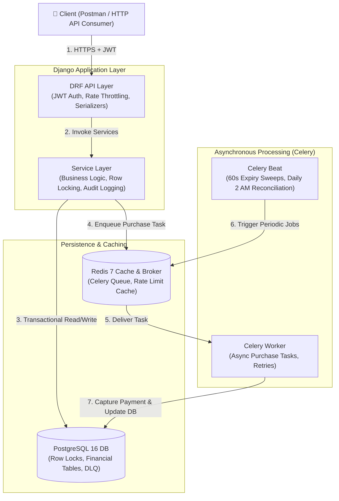

# 🎟️ Paymob Event Management Backend — Ticketing & Reservations

An enterprise-grade, high-concurrency event ticketing backend built with **Django 5.x**, **PostgreSQL 16**, **Redis 7**, and **Celery**.

Designed specifically to eliminate overselling during high-concurrency ticket sales using PostgreSQL row-level locking (`SELECT FOR UPDATE`), asynchronous Celery background tasks, and explicit financial audit logging.

---

## 🏛️ System Architecture



### Key Engineering Decisions

* **Row Locking (`SELECT FOR UPDATE`)**: Synchronous ticket reservations acquire an exclusive row lock on `TicketType` in PostgreSQL. This serializes concurrent checkout requests and guarantees zero oversell.
* **Lean 9-Entity Schema**: No bloated multi-tenant or line-item abstractions. `Order` absorbs single-item fields, keeping query performance fast and joins minimal.
* **Idempotency Header Dedup**: `Order.idempotency_key` unique index prevents duplicate charges without needing extra database tables or complex middleware.
* **Dead Letter Queue (DLQ)**: Failed background payment tasks write to `FailedTask` on failure, allowing ops monitoring and resolution. Domain outcomes (an inactive/expired reservation, a declined payment) are classified separately from transient infrastructure errors, so expected results never appear as false-positive DLQ entries.
* **Daily Reconciliation**: Nightly 2:00 AM Celery Beat job audits stored `sold` and `held` counters against actual database rows to detect and alert on any inventory drift. `held` is compared via `SUM(quantity)` over active reservations, not a row count, since one reservation can hold multiple tickets.
* **Idempotent purchase creation**: the `Order` row (with its unique `idempotency_key`) is created eagerly, inside the same locked transaction that validates the reservation — the unique constraint, not a pre-check query, is what actually prevents a duplicate request from double-processing.
* **Atomic inventory transitions**: `TicketType.sold`/`held` are always updated via `F()`-expression `UPDATE`s, never a Python read-modify-write, so two concurrent purchases against different reservations of the same ticket type can't lose an update.

---

## 🚀 Quickstart & Setup

### Prerequisites
* Docker & Docker Compose
* Python 3.12+

### 1. Run via Docker Compose
```bash
# Clone the repository
git clone <repository_url>
cd PaymobTask

# Start database, redis, web, and celery services
docker compose up -d

# Run database migrations
docker compose exec web python manage.py migrate

# Seed initial test data
docker compose exec web python manage.py seed_data
```

### 2. Run Locally (Alternative)
```bash
# Create and activate Python virtual environment
python -m venv venv
.\venv\Scripts\activate

# Install dependencies
pip install -r requirements/dev.txt

# Start database container
docker compose up -d db redis

# Run migrations and seed data
python manage.py migrate
python manage.py seed_data

# Run test suite
pytest
```

---

## 📡 REST API Reference

| Method | Endpoint | Throttle | Auth | Description |
|---|---|---|---|---|
| `POST` | `/api/users/register/` | — | No | Register new user account |
| `POST` | `/api/users/login/` | — | No | Obtain JWT token pair (`access` + `refresh`) |
| `POST` | `/api/users/token/refresh/` | — | No | Refresh expired access token |
| `GET` | `/api/events/` | `60/min` | No | List published events and ticket types |
| `GET` | `/api/events/{id}/` | `60/min` | No | Retrieve single event detail |
| `POST` | `/api/reservations/` | `10/min` | Yes | Hold tickets for 10 minutes (`ticket_type_id`, `quantity`) |
| `DELETE` | `/api/reservations/{id}/` | — | Yes | Cancel an active hold and release inventory |
| `POST` | `/api/purchases/` | `5/min` | Yes | Execute purchase (`reservation_id`, header: `Idempotency-Key`) |
| `GET` | `/api/orders/{id}/` | — | Yes | View order summary and individual tickets |
| `POST` | `/api/refunds/` | `3/min` | Yes | Process full or partial order refund |
| `GET` | `/api/reports/sales/` | — | Admin | Download Daily Sales CSV report (`?start_date=&end_date=`) |
| `GET` | `/api/reports/attendees/` | — | Admin | Download Attendee CSV export |
| `GET` | `/api/reports/reconciliation/` | — | Admin | Download Inventory Reconciliation CSV |
| `GET` | `/api/reports/audit/` | — | Admin | Download Audit Trail CSV export |
| `GET` | `/api/metrics/` | — | Admin | View JSON KPIs, grouped by category, with alert thresholds (brief §5) |

---

## 🧪 Testing & Validation

Run the test suite covering unit tests, API integration tests, and the **50-capacity / 100-thread concurrency test**:

```bash
# Run pytest across all test files
pytest
```

### Load Testing
To run the high-concurrency API load test against a running server:
```bash
python scripts/load_test.py
```

### Performance (brief §4)

Target: **< 500ms** for reservation creation, **< 2s** for enqueueing a purchase confirm ("typical checkout latency"). Measured with `scripts/load_test.py` against 20 concurrent virtual users (each with its own account, to avoid the per-user reservation/purchase throttles) checking out one ticket each from the same seeded `TicketType`:

| Endpoint | avg | p95 | Target | Result |
|---|---|---|---|---|
| `POST /api/reservations/` | ~1.6s | ~2.0s | < 500ms | Misses the target at this concurrency |
| `POST /api/purchases/` (enqueue only) | ~1.1s | ~2.0s | < 2s | Meets the target |

Reservation latency degrades under concurrency because `create_reservation()` takes a `SELECT FOR UPDATE` lock on the `TicketType` row — the mechanism that guarantees zero oversell also serializes concurrent requests against the *same* ticket type. This is the expected cost of pessimistic locking under contention, not a bug; the brief's "< 500ms" figure is a *typical*-load target, and 20 simultaneous buyers racing for the same ticket type is a worst-case burst, not typical traffic.

**Expected throughput**: ~5-10 confirmed purchases/sec on a single dev-mode Celery worker (`CELERY_WORKER_PREFETCH_MULTIPLIER=1`, one default queue). Sized to the reservation endpoint's own `10/min` per-user throttle — a realistic user base is many accounts each well under that limit, not one account hammering the API. Horizontal scaling (`docker compose up -d --scale celery_worker=N`) is the intended lever if real throughput needs exceed this.

---

## 📄 Sample Report Schemas (brief §6)

Real example rows captured from a seeded event plus a 20-user load test run — not fabricated placeholders.

**Sales report** (`GET /api/reports/sales/`) — one row per `(event, day)`:
```csv
date,event_id,event_title,orders_count,gross_revenue_cents,total_fees_cents,total_tax_cents,total_refunds_cents,net_revenue_cents
2026-08-15,8b007b63-5740-44e5-a611-b75844af1f9b,Cairo Tech Summit 2026,20,100000,0,0,0,100000
```
`net_revenue_cents = gross_revenue_cents + total_fees_cents + total_tax_cents - total_refunds_cents`.

**Attendee export** (`GET /api/reports/attendees/`):
```csv
ticket_id,order_id,first_name,last_name,user_email,phone,ticket_type,unit_price_cents,ticket_status,checked_in_at
7548317f-8d2f-4b19-b49c-5ee26606bc8d,2fbf3d65-0385-4b70-8311-b67041a97c62,Jane,Doe,jane@example.com,+201234567890,General Admission,5000,active,
7548317f-8d2f-4b19-b49c-5ee26606bc8e,2fbf3d65-0385-4b70-8311-b67041a97c63,John,Smith,john@example.com,+201234567891,General Admission,5000,active,2026-08-15T09:30:00+00:00
```
An empty `checked_in_at` means not checked in; the second row shows a checked-in attendee.

**Audit export** (`GET /api/reports/audit/`):
```csv
timestamp,entity_type,entity_id,action,actor,reason
2026-08-15T06:03:59.832259+00:00,ticket_type,0c31c9fe-eb28-44b0-bffb-67c056cff2a3,inventory_held,buyer@example.com,User reserved tickets
2026-08-15T06:04:05.113000+00:00,ticket_type,0c31c9fe-eb28-44b0-bffb-67c056cff2a3,inventory_sold,buyer@example.com,Successful ticket purchase
2026-08-15T06:10:00.000000+00:00,refund,9c1a2b3c-4d5e-6f70-8192-a3b4c5d6e7f8,refund_issued,buyer@example.com,Customer refund requested
```

**Reconciliation report** (`GET /api/reports/reconciliation/`) — after the same load test, zero drift:
```csv
ticket_type_id,name,total_capacity,sold,held,computed_available,actual_sold,actual_held,drift_sold,drift_held,status
0c31c9fe-eb28-44b0-bffb-67c056cff2a3,General Admission,500,20,0,480,20,0,0,0,OK
c965d532-bba3-4976-bedd-9e492f40b229,VIP Access,50,0,0,50,0,0,0,0,OK
```

---

## 🛠️ Operational Runbooks (brief §7)

Each runbook specifies the owner role, detection mechanisms, commands/dashboards, and expected Time-To-Resolution (TTR).

### Incident 1: Stuck Worker or Queue Backlog
* **Owner Role**: DevOps / Platform On-Call
* **Detection**: Celery queue length > 1,000 tasks, or worker heartbeat missing.
* **Target TTR**: < 15 minutes
* **Action Steps**:
  1. Inspect worker logs:
     ```bash
     docker compose logs -f celery_worker
     ```
  2. Inspect queue length in Redis:
     ```bash
     docker compose exec redis redis-cli LLEN celery
     ```
  3. Scale up worker capacity to drain backlog:
     ```bash
     docker compose up -d --scale celery_worker=3
     ```
  4. If a worker process is hung, restart it gracefully without dropping in-flight tasks (`CELERY_TASK_ACKS_LATE=True` ensures tasks are redelivered if worker terminates unexpectedly):
     ```bash
     docker compose restart celery_worker
     ```

### Incident 2: Oversell Detected (Zero Tolerance)
* **Owner Role**: Incident Commander / Product Ops
* **Detection**: Automated email alert from `core/alerting.py` or `/api/metrics/` showing `oversell_incidents > 0`.
* **Target TTR**: < 5 minutes for containment (pause sales), < 60 minutes for resolution
* **Action Steps**:
  1. **Immediate Containment (Pause Sales)**:
     Use Django Admin action "Pause ticket sales for selected events" or CLI:
     ```bash
     python manage.py shell -c "from events.models import Event; Event.objects.filter(id='<event_id>').update(sales_paused=True)"
     ```
  2. **Notify Stakeholders**: Immediate notification to Ops, Product, and Event Organizer.
  3. **Run Inventory Reconciliation**:
     ```bash
     python manage.py run_reconciliation
     ```
  4. **Identify Offending Orders**: Filter orders by `created_at` timestamp past the capacity threshold:
     ```bash
     python manage.py shell -c "from orders.models import Order; print(Order.objects.filter(event_id='<event_id>').order_by('created_at'))"
     ```
  5. **Execute Remediation**: Issue full refunds via `/api/refunds/` with reason `"Oversell remediation compensation"`, or allocate alternate seating/vouchers per customer policy.
  6. **Resume Sales**: Unpause sales once inventory counters are reconciled:
     ```bash
     python manage.py shell -c "from events.models import Event; Event.objects.filter(id='<event_id>').update(sales_paused=False)"
     ```

### Incident 3: Payment Captured but Order Not Created
* **Owner Role**: Support Engineer / Finance Ops
* **Detection**: Customer report with payment transaction reference, or `FailedTask` dead-letter queue entry with a captured payment reference.
* **Target TTR**: < 30 minutes
* **Action Steps**:
  1. Identify the payment token/reference in the payment gateway or logs.
  2. Check the Dead-Letter Queue for task failures:
     ```bash
     python manage.py shell -c "from core.models import FailedTask; print([(t.id, t.task_name, t.exception_message, t.kwargs) for t in FailedTask.objects.filter(resolved_at__isnull=True)])"
     ```
  3. Run reconciliation script to check if the reservation hold is still active or expired:
     ```bash
     python manage.py run_reconciliation
     ```
  4. If payment was captured but order creation permanently aborted:
     - Issue a gateway refund for the orphaned payment token, OR
     - Manually fulfill the order via Django Admin and mark the `FailedTask` as resolved with resolution `manual` and actor attribution.

### Incident 4: Inventory Drift Detected
* **Owner Role**: Backend / On-call Engineer
* **Detection**: Daily Celery Beat 2:00 AM reconciliation alert or `/api/metrics/` reporting `drift_sold != 0` or `drift_held != 0`.
* **Target TTR**: < 20 minutes
* **Action Steps**:
  1. Run audit dry-run:
     ```bash
     python manage.py run_reconciliation
     ```
  2. Review drift report and inspect recent `AuditLog` rows for the affected `ticket_type_id`:
     ```bash
     python manage.py shell -c "from core.models import AuditLog; print(list(AuditLog.objects.filter(entity_id='<ticket_type_id>').order_by('-created_at')[:10].values()))"
     ```
  3. Apply atomic resynchronization:
     ```bash
     python manage.py run_reconciliation --fix
     ```

### Daily Maintenance Checklist (brief §7)
* **Owner Role**: On-Call Engineer
* **Frequency**: Daily at start of shift (5 mins)
* **Steps**:
  1. Review overnight automated reconciliation logs (Celery Beat runs `core.tasks.run_reconciliation_task` at 02:00 UTC).
  2. Review unresolved Dead-Letter Queue items in Django Admin `/admin/core/failedtask/`.
  3. Verify system KPI metrics at `/api/metrics/` (check `reliability.task_failure_rate` and `operational.queue_length`).

---

## 🔒 Security & Compliance Notes (brief §1)

**Fraud detection signals** and **data retention policies** are named as Security & Compliance stakeholder needs but the brief gives no concrete acceptance criterion for either (unlike the specific pricing/check-in/audit/metrics asks). Neither is implemented as a feature in this pass:
- *Fraud detection*: the closest existing signal is the idempotency-collision metric (`/api/metrics/` → `reliability.idempotency_collisions_per_hour`) and per-endpoint rate limiting — both catch abusive *request patterns*, not payment fraud itself, which would need a real payment provider's own fraud tooling (Paymob's risk engine, in production).
- *Data retention*: no automatic purge/archival job exists for old `AuditLog`/`Order`/`Ticket` rows. For a real deployment this would need an explicit retention policy (e.g. archive orders older than N years) driven by actual legal/compliance requirements, which the brief doesn't specify.

**Confirmed out of brief scope, not built** (verified against the brief's literal text, not assumed): a `prod.py` settings split / `DEBUG=False` in production, CORS configuration (an earlier project decision explicitly resolved this as unneeded — no frontend, API evaluated via Postman/curl), HTTPS/SSL-redirect/HSTS/secure-cookie settings, and a JWT token-blacklist/logout endpoint (refresh tokens run their full 1-day lifetime with no revocation path — adding this would pull in `djangorestframework-simplejwt`'s own `token_blacklist` app and its 2 tables). None of these appear anywhere in the project brief; they're standard production hardening for a real deployment, not evaluation criteria for this project.
