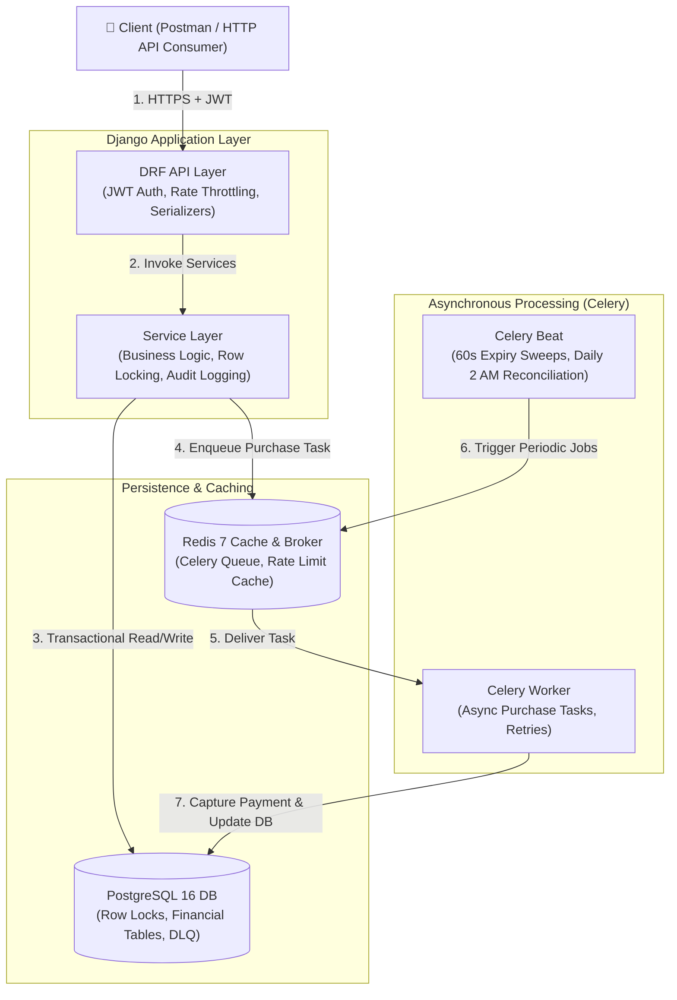

# 🎟️ Paymob Event Management Backend — Ticketing & Reservations

An enterprise-grade, high-concurrency event ticketing backend built with **Django 5.x**, **PostgreSQL 16**, **Redis 7**, and **Celery**.

Designed specifically to eliminate overselling during high-concurrency ticket sales using PostgreSQL row-level locking (`SELECT FOR UPDATE`), asynchronous Celery background tasks, and explicit financial audit logging.

---

## 🏛️ System Architecture



### Key Engineering Decisions

* **Row Locking (`SELECT FOR UPDATE`)**: Synchronous ticket reservations acquire an exclusive row lock on `TicketType` in PostgreSQL. This serializes concurrent checkout requests and guarantees zero oversell.
* **Lean 9-Entity Schema**: No bloated multi-tenant or line-item abstractions. `Order` absorbs single-item fields, keeping query performance fast and joins minimal.
* **Idempotency Header Dedup**: `Order.idempotency_key` unique index prevents duplicate charges without needing extra database tables or complex middleware.
* **Dead Letter Queue (DLQ)**: Failed background payment tasks write to `FailedTask` on failure, allowing ops monitoring and resolution.
* **Daily Reconciliation**: Nightly 2:00 AM Celery Beat job audits stored `sold` and `held` counters against actual database rows to detect and alert on any inventory drift.

---

## 🚀 Quickstart & Setup

### Prerequisites
* Docker & Docker Compose
* Python 3.12+

### 1. Run via Docker Compose
```bash
# Clone the repository
git clone <repository_url>
cd PaymobTask

# Start database, redis, web, and celery services
docker compose up -d

# Run database migrations
docker compose exec web python manage.py migrate

# Seed initial test data
docker compose exec web python manage.py seed_data
```

### 2. Run Locally (Alternative)
```bash
# Create and activate Python virtual environment
python -m venv venv
.\venv\Scripts\activate

# Install dependencies
pip install -r requirements/dev.txt

# Start database container
docker compose up -d db redis

# Run migrations and seed data
python manage.py migrate
python manage.py seed_data

# Run test suite
pytest
```

---

## 📡 REST API Reference

| Method | Endpoint | Throttle | Auth | Description |
|---|---|---|---|---|
| `POST` | `/api/users/register/` | — | No | Register new user account |
| `POST` | `/api/users/login/` | — | No | Obtain JWT token pair (`access` + `refresh`) |
| `POST` | `/api/users/token/refresh/` | — | No | Refresh expired access token |
| `GET` | `/api/events/` | `60/min` | No | List published events and ticket types |
| `GET` | `/api/events/{id}/` | `60/min` | No | Retrieve single event detail |
| `POST` | `/api/reservations/` | `10/min` | Yes | Hold tickets for 10 minutes (`ticket_type_id`, `quantity`) |
| `DELETE` | `/api/reservations/{id}/` | — | Yes | Cancel an active hold and release inventory |
| `POST` | `/api/purchases/` | `5/min` | Yes | Execute purchase (`reservation_id`, header: `Idempotency-Key`) |
| `GET` | `/api/orders/{id}/` | — | Yes | View order summary and individual tickets |
| `POST` | `/api/refunds/` | `3/min` | Yes | Process full or partial order refund |
| `GET` | `/api/reports/sales/` | — | Admin | Download Daily Sales CSV report |
| `GET` | `/api/reports/attendees/` | — | Admin | Download Attendee CSV export |
| `GET` | `/api/reports/reconciliation/` | — | Admin | Download Inventory Reconciliation CSV |
| `GET` | `/api/metrics/` | — | Admin | View JSON KPIs (`orders_last_hour`, `gross_revenue_cents`, `drift_count`) |

---

## 🧪 Testing & Validation

Run the test suite covering unit tests, API integration tests, and the **50-capacity / 100-thread concurrency test**:

```bash
# Run pytest across all test files
pytest
```

### Load Testing
To run the high-concurrency API load test against a running server:
```bash
python scripts/load_test.py
```

---

## 🛠️ Operational Runbooks

### Incident 1: Worker Queue Backlog
* **Detection**: Celery queue length > 1,000 tasks.
* **Resolution**:
  ```bash
  # Check queue length
  redis-cli LLEN celery
  # Scale worker containers
  docker compose up -d --scale celery_worker=3
  ```

### Incident 2: Inventory Drift Detected
* **Detection**: Nightly reconciliation command or `/api/metrics/` alerts `reconciliation_drift_count > 0`.
* **Resolution**:
  ```bash
  # Run reconciliation audit to inspect drift
  python manage.py run_reconciliation

  # Apply auto-fix to resynchronize counters
  python manage.py run_reconciliation --fix
  ```

### Incident 3: Unresolved DLQ Tasks
* **Detection**: `FailedTask` table has entries where `resolved_at` is null.
* **Resolution**:
  ```bash
  # Inspect unresolved tasks via Django shell
  python manage.py shell -c "from core.models import FailedTask; print(FailedTask.objects.filter(resolved_at__isnull=True))"
  ```
