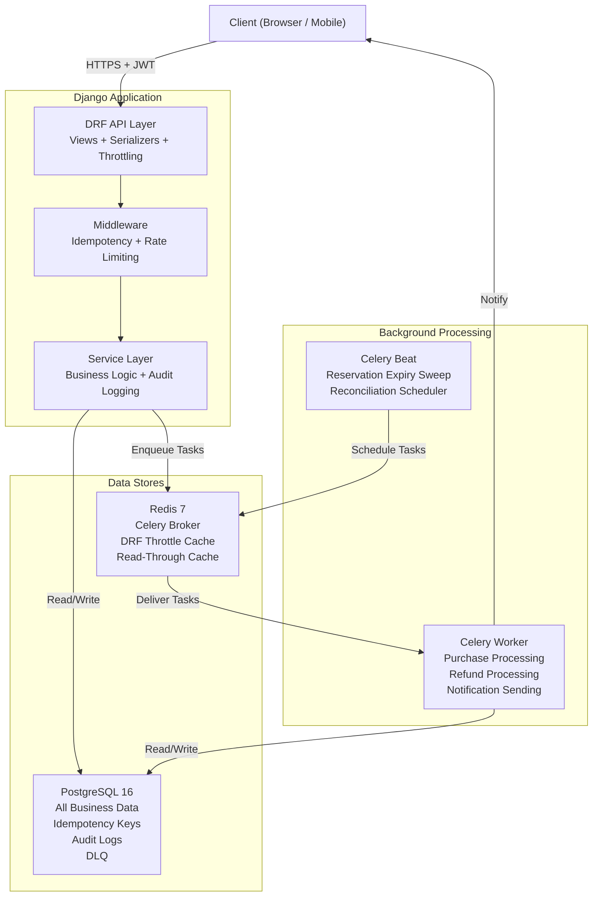
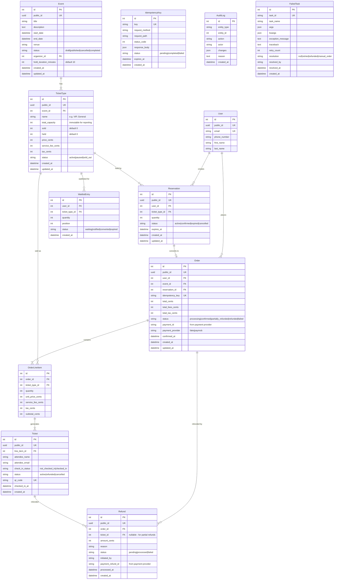

# Ticketing & Reservations Backend — Implementation Plan

> [!IMPORTANT]
> This plan covers the full system: database schema, concurrency controls, rate-limiting, Celery task design, and operational runbooks. Read each section carefully — hidden "gotcha" tips are marked with 💡.

---

## 1. Architecture Overview



**Key Architectural Decisions:**

| Decision | Choice | Rationale |
|---|---|---|
| Concurrency control | Pessimistic locking (atomic conditional `UPDATE`) + `lock_timeout` | Correctness-first; simplest to reason about and debug |
| Inventory model | `held` + `sold` counters; `available = total - sold - held` | Guarantees the hold window; finance sees clean `sold` number |
| Sync/Async boundary | Sync reservation, async purchase (Celery) | Fast critical path (reserve); resilient slow path (pay) |
| Service layer | Hexagonal — views and tasks both call service functions | Single source of business logic; no duplication |
| API framework | Django REST Framework | Built-in throttling, serializers, auth; industry standard |
| Auth | JWT (simplejwt) + Django Groups for roles | Stateless; standard for APIs |
| Primary keys | Auto-increment internal + UUID `public_id` | Fast JOINs internally; non-guessable externally |

---

## 2. Database Schema

> [!NOTE]
> **💡 Tip:** Always read the reporting/export requirements before designing the schema. They reveal the true granularity needed. The brief's attendee export with check-in status requires individual `Ticket` records — not just a quantity on the order.

### 2.1 Entity-Relationship Diagram



### 2.2 Critical Indexes

> [!NOTE]
> **💡 Postgres Tip:** Indexes on columns used in `WHERE`, `JOIN`, and `ORDER BY` clauses. Partial indexes save space by only indexing rows that match a condition.

```sql
-- TicketType: the hot row for concurrency
-- No extra index needed beyond PK — we lock by PK

-- Reservation: expiry sweep needs to find active expired reservations fast
CREATE INDEX idx_reservation_expiry 
    ON reservations (expires_at) 
    WHERE status = 'active';

-- Reservation: lookup by user for "my reservations"
CREATE INDEX idx_reservation_user_status 
    ON reservations (user_id, status);

-- Order: idempotency key lookup (already UNIQUE, so indexed)
-- Order: user's orders
CREATE INDEX idx_order_user 
    ON orders (user_id, created_at DESC);

-- Order: event reporting
CREATE INDEX idx_order_event_status 
    ON orders (event_id, status);

-- Ticket: attendee export needs ticket + check-in status per event
CREATE INDEX idx_ticket_checkin 
    ON tickets (check_in_status) 
    WHERE status = 'active';

-- AuditLog: query by entity
CREATE INDEX idx_audit_entity 
    ON audit_logs (entity_type, entity_id, created_at DESC);

-- FailedTask: ops dashboard shows unresolved tasks
CREATE INDEX idx_failed_task_unresolved 
    ON failed_tasks (created_at DESC) 
    WHERE resolved_at IS NULL;

-- IdempotencyKey: cleanup old keys
CREATE INDEX idx_idempotency_expires 
    ON idempotency_keys (expires_at) 
    WHERE status != 'pending';
```

### 2.3 Database Constraints

> [!NOTE]
> **💡 Tip:** Database-level constraints are your last line of defense. Even if your application code has a bug, the database should refuse to enter an invalid state. This is called **defense in depth**.

```sql
-- Prevent negative inventory (even if application code has a bug)
ALTER TABLE ticket_types ADD CONSTRAINT chk_sold_non_negative CHECK (sold >= 0);
ALTER TABLE ticket_types ADD CONSTRAINT chk_held_non_negative CHECK (held >= 0);
ALTER TABLE ticket_types ADD CONSTRAINT chk_no_oversell CHECK (sold + held <= total_capacity);

-- Ensure capacity is immutable (enforced at application level, but CHECK as guardrail)
-- total_capacity can only be set on INSERT, not UPDATE — enforced via Django model

-- Prices must be non-negative
ALTER TABLE ticket_types ADD CONSTRAINT chk_price_positive CHECK (price_cents >= 0);
ALTER TABLE orders ADD CONSTRAINT chk_total_positive CHECK (total_cents >= 0);
ALTER TABLE refunds ADD CONSTRAINT chk_refund_positive CHECK (amount_cents > 0);
```

---

## 3. Concurrency Controls

### 3.1 Reservation Flow (Synchronous)

> [!IMPORTANT]
> This is the correctness-critical path. Every line matters.

```python
# reservations/services.py

def create_reservation(user, ticket_type_id, quantity):
    """
    Atomically reserve tickets.
    Uses a single conditional UPDATE to minimize lock duration.
    
    💡 TIP: The WHERE clause does the capacity check IN the database,
    not in Python. This means the lock is held only for the duration 
    of the UPDATE statement (~5ms), not for a SELECT + Python logic + UPDATE (~20ms).
    """
    with transaction.atomic():
        # Set lock_timeout to prevent cascading waits under extreme load
        # 💡 TIP: Without this, if 1000 users hit the same ticket type,
        # the last user waits 20+ seconds. With it, they get a fast failure.
        with connection.cursor() as cursor:
            cursor.execute("SET LOCAL lock_timeout = '3s'")
        
        # Single atomic conditional UPDATE
        # This acquires a row-level lock, checks capacity, and updates in one statement
        updated = TicketType.objects.filter(
            id=ticket_type_id,
            status='active',
        ).annotate(
            available=F('total_capacity') - F('sold') - F('held')
        ).filter(
            available__gte=quantity
        ).update(
            held=F('held') + quantity
        )
        
        if updated == 0:
            # Either: ticket type doesn't exist, is paused, or not enough capacity
            ticket_type = TicketType.objects.filter(id=ticket_type_id).first()
            if not ticket_type:
                raise TicketTypeNotFoundError()
            if ticket_type.status != 'active':
                raise TicketTypePausedError()
            raise InsufficientCapacityError()
        
        # Get the event's hold duration (or default 10 min)
        ticket_type = TicketType.objects.select_related('event').get(id=ticket_type_id)
        hold_minutes = ticket_type.event.hold_duration_minutes
        
        reservation = Reservation.objects.create(
            user=user,
            ticket_type=ticket_type,
            quantity=quantity,
            status='active',
            expires_at=now() + timedelta(minutes=hold_minutes),
        )
        
        # Explicit audit log (not a signal!)
        # 💡 TIP: Inside the same transaction, so if anything fails, 
        # both the reservation AND the audit log are rolled back together.
        AuditLog.record(
            entity_type='ticket_type',
            entity_id=ticket_type_id,
            action='inventory_held',
            actor=user.email,
            reason=f'Reservation {reservation.public_id}',
            changes={'held': {'delta': quantity}},
        )
        
        # Schedule delayed expiry task
        expire_reservation.apply_async(
            args=[reservation.id],
            eta=reservation.expires_at,
        )
    
    return reservation
```

### 3.2 Purchase Flow (Asynchronous)

```python
# orders/services.py

def process_purchase(reservation_id, idempotency_key, actor_email):
    """
    Finalize a purchase. Called by the Celery worker.
    
    💡 TIP: This runs inside the Celery worker, NOT in the HTTP request.
    The view only enqueues the task and returns 202 Accepted.
    """
    with transaction.atomic():
        with connection.cursor() as cursor:
            cursor.execute("SET LOCAL lock_timeout = '3s'")
        
        # Lock the reservation row to prevent double-confirmation
        reservation = (
            Reservation.objects
            .select_for_update()
            .select_related('ticket_type', 'ticket_type__event', 'user')
            .get(id=reservation_id)
        )
        
        # Check reservation is still valid
        # 💡 TIP: The expiry sweep might have expired this reservation
        # between the user clicking "Pay" and the worker processing it.
        if reservation.status != 'active':
            raise ReservationNotActiveError(f"Reservation is {reservation.status}")
        if reservation.expires_at < now():
            reservation.status = 'expired'
            reservation.save()
            raise ReservationExpiredError()
        
        ticket_type = reservation.ticket_type
        
        # Simulate payment (Strategy Pattern)
        payment_provider = get_payment_provider()  # Returns FakeProvider or PaymobProvider
        payment_result = payment_provider.capture(
            amount_cents=ticket_type.price_cents * reservation.quantity,
            token="user_payment_token",  # Would come from client in real impl
            idempotency_key=idempotency_key,
        )
        
        if not payment_result.success:
            raise PaymentFailedError(payment_result.error)
        
        # Move from held to sold (atomic conditional update)
        updated = TicketType.objects.filter(
            id=ticket_type.id,
            held__gte=reservation.quantity,
        ).update(
            held=F('held') - reservation.quantity,
            sold=F('sold') + reservation.quantity,
        )
        
        if updated == 0:
            # 💡 HIDDEN GOTCHA: This should never happen if the system is correct.
            # If it does, it means the expiry job decremented `held` for this
            # reservation WHILE we were processing the purchase.
            # This is a reconciliation incident — log it and alert.
            raise InventoryInconsistencyError("held count mismatch during purchase")
        
        # Create order
        order = Order.objects.create(
            user=reservation.user,
            event=ticket_type.event,
            reservation=reservation,
            idempotency_key=idempotency_key,
            total_cents=ticket_type.price_cents * reservation.quantity,
            total_fees_cents=ticket_type.service_fee_cents * reservation.quantity,
            total_tax_cents=ticket_type.tax_cents * reservation.quantity,
            status='confirmed',
            payment_id=payment_result.payment_id,
            payment_provider=payment_provider.name,
            confirmed_at=now(),
        )
        
        # Create line item
        line_item = OrderLineItem.objects.create(
            order=order,
            ticket_type=ticket_type,
            quantity=reservation.quantity,
            unit_price_cents=ticket_type.price_cents,
            service_fee_cents=ticket_type.service_fee_cents,
            tax_cents=ticket_type.tax_cents,
            subtotal_cents=ticket_type.price_cents * reservation.quantity,
        )
        
        # Create individual tickets
        tickets = Ticket.objects.bulk_create([
            Ticket(
                line_item=line_item,
                attendee_name=reservation.user.get_full_name(),
                attendee_email=reservation.user.email,
                check_in_status='not_checked_in',
                status='active',
                qr_code=str(uuid4()),
            )
            for _ in range(reservation.quantity)
        ])
        
        # Update reservation status
        reservation.status = 'confirmed'
        reservation.save()
        
        # Audit
        AuditLog.record(
            entity_type='ticket_type',
            entity_id=ticket_type.id,
            action='inventory_sold',
            actor=reservation.user.email,
            reason=f'Order {order.public_id}',
            changes={
                'held': {'delta': -reservation.quantity},
                'sold': {'delta': reservation.quantity},
            },
        )
    
    # Send confirmation notification (outside transaction — it's ok if this fails)
    send_order_confirmation.delay(order.id)
    
    return order
```

### 3.3 Reservation Expiry (Hybrid: Delayed Task + Periodic Sweep)

```python
# reservations/tasks.py

@shared_task(bind=True, max_retries=3, default_retry_delay=30)
def expire_reservation(self, reservation_id):
    """
    Per-reservation delayed task — runs at exactly expires_at.
    
    💡 TIP: This is the "belt" in "belt and suspenders."
    The periodic sweep (below) is the "suspenders."
    """
    try:
        with transaction.atomic():
            reservation = (
                Reservation.objects
                .select_for_update(skip_locked=True)  
                # 💡 skip_locked: if another process is already expiring this, skip it
                .filter(id=reservation_id, status='active')
                .first()
            )
            
            if not reservation:
                return  # Already expired/confirmed by another process
            
            if reservation.expires_at > now():
                return  # Not yet expired (task ran early due to clock skew)
            
            # Decrement held
            TicketType.objects.filter(
                id=reservation.ticket_type_id,
                held__gte=reservation.quantity,
            ).update(
                held=F('held') - reservation.quantity,
            )
            
            reservation.status = 'expired'
            reservation.save()
            
            AuditLog.record(
                entity_type='reservation',
                entity_id=reservation.id,
                action='reservation_expired',
                actor='system',
                reason='Hold window exceeded',
                changes={'status': {'old': 'active', 'new': 'expired'}},
            )
    except Exception as exc:
        self.retry(exc=exc)


@shared_task
def sweep_expired_reservations():
    """
    Periodic safety net — runs every 5 minutes via Celery Beat.
    Catches any reservations the delayed tasks missed.
    
    💡 TIP: This query uses the partial index idx_reservation_expiry
    which only indexes active reservations. Very efficient.
    """
    stale = Reservation.objects.filter(
        status='active',
        expires_at__lt=now(),
    ).select_for_update(skip_locked=True)
    
    expired_count = 0
    for reservation in stale:
        with transaction.atomic():
            TicketType.objects.filter(
                id=reservation.ticket_type_id,
                held__gte=reservation.quantity,
            ).update(
                held=F('held') - reservation.quantity,
            )
            reservation.status = 'expired'
            reservation.save()
            expired_count += 1
    
    if expired_count > 0:
        logger.info(f"Sweep expired {expired_count} stale reservations")
```

---

## 4. Rate Limiting

Using DRF's built-in throttling backed by Redis:

```python
# config/settings/base.py

REST_FRAMEWORK = {
    'DEFAULT_THROTTLE_CLASSES': [
        'rest_framework.throttling.ScopedRateThrottle',
    ],
    'DEFAULT_THROTTLE_RATES': {
        'reserve': '10/min',        # POST /api/reserve/
        'purchase': '5/min',        # POST /api/purchase/
        'refund': '3/min',          # POST /api/refund/
        'events_list': '60/min',    # GET /api/events/
        'events_detail': '120/min', # GET /api/events/{id}/
    },
}

CACHES = {
    'default': {
        'BACKEND': 'django_redis.cache.RedisCache',
        'LOCATION': 'redis://redis:6379/1',
        'OPTIONS': {
            'CLIENT_CLASS': 'django_redis.client.DefaultClient',
        },
    },
}
```

```python
# reservations/views.py

class ReservationCreateView(CreateAPIView):
    throttle_scope = 'reserve'
    permission_classes = [IsAuthenticated]
    serializer_class = ReservationCreateSerializer
    
    def create(self, request, *args, **kwargs):
        serializer = self.get_serializer(data=request.data)
        serializer.is_valid(raise_exception=True)
        
        try:
            reservation = create_reservation(
                user=request.user,
                ticket_type_id=serializer.validated_data['ticket_type_id'],
                quantity=serializer.validated_data['quantity'],
            )
        except InsufficientCapacityError:
            return Response(
                {'error': 'Not enough tickets available'},
                status=status.HTTP_409_CONFLICT,
            )
        except OperationalError:
            # 💡 TIP: lock_timeout exceeded — system is under extreme load
            return Response(
                {'error': 'System is busy, please try again'},
                status=status.HTTP_503_SERVICE_UNAVAILABLE,
            )
        
        return Response(
            ReservationResponseSerializer(reservation).data,
            status=status.HTTP_201_CREATED,
        )
```

### Rate Limit Fraud Detection Signals

> [!TIP]
> **Security (007 skill):** Beyond rate limiting, track these signals for fraud detection:
> - Multiple reservations from the same IP for the same event (scalper bots)
> - Rapid sequential reservations that are never completed (inventory denial-of-service)
> - Idempotency key reuse with different request bodies (replay attack attempt)

```python
# core/middleware.py

class FraudSignalMiddleware:
    """
    Logs suspicious patterns for ops review.
    Does NOT block requests — that's the rate limiter's job.
    This just generates signals for a human to review.
    """
    def __call__(self, request):
        response = self.get_response(request)
        
        if request.path.startswith('/api/reserve/') and request.method == 'POST':
            # Count recent reservations from this IP
            cache_key = f"fraud:reserve_count:{get_client_ip(request)}"
            count = cache.incr(cache_key, 1)
            if count == 1:
                cache.expire(cache_key, 3600)  # 1 hour window
            
            if count > 20:
                logger.warning(
                    f"Fraud signal: {count} reservations from IP {get_client_ip(request)} in 1 hour"
                )
        
        return response
```

---

## 5. Idempotency Implementation

```python
# core/middleware.py

class IdempotencyMiddleware:
    """
    Enforces idempotency for POST requests with an Idempotency-Key header.
    
    💡 TIP: This middleware checks BEFORE the view runs.
    If the key exists and is 'completed', it returns the cached response immediately.
    If the key exists and is 'pending', it returns 409 (another request is processing).
    If the key doesn't exist, it creates a 'pending' entry and lets the view proceed.
    """
    IDEMPOTENT_PATHS = ['/api/purchase/', '/api/refund/']
    
    def __call__(self, request):
        if request.method != 'POST' or request.path not in self.IDEMPOTENT_PATHS:
            return self.get_response(request)
        
        key = request.headers.get('Idempotency-Key')
        if not key:
            return JsonResponse(
                {'error': 'Idempotency-Key header is required'},
                status=400,
            )
        
        # Check for existing key
        existing = IdempotencyKey.objects.filter(key=key).first()
        
        if existing:
            if existing.status == 'completed':
                return JsonResponse(existing.response_body, status=existing.status_code)
            if existing.status == 'pending':
                return JsonResponse(
                    {'error': 'Request is already being processed'},
                    status=409,
                )
            # status == 'failed': allow retry with same key
        
        # Create pending entry
        idem_entry, created = IdempotencyKey.objects.get_or_create(
            key=key,
            defaults={
                'request_method': request.method,
                'request_path': request.path,
                'status': 'pending',
                'expires_at': now() + timedelta(hours=24),
            },
        )
        
        if not created and idem_entry.status != 'failed':
            # Race condition: another request created it between our check and create
            return JsonResponse({'error': 'Request is already being processed'}, status=409)
        
        # Let the view proceed
        response = self.get_response(request)
        
        # Store the response
        idem_entry.status = 'completed' if response.status_code < 500 else 'failed'
        idem_entry.status_code = response.status_code
        idem_entry.response_body = json.loads(response.content)
        idem_entry.save()
        
        return response
```

---

## 6. Dead Letter Queue

```python
# core/signals.py (Celery signals, NOT Django model signals)

from celery.signals import task_failure

@task_failure.connect
def handle_task_failure(sender, task_id, exception, traceback, args, kwargs, **kw):
    """
    Automatically captures permanently failed tasks into the DLQ.
    
    💡 TIP: This fires AFTER all retries are exhausted. 
    Celery signals are different from Django signals — they're event hooks 
    on the task lifecycle, not the ORM lifecycle.
    """
    # Only capture after all retries exhausted
    if sender.request.retries < sender.max_retries:
        return  # Still has retries left, don't DLQ yet
    
    FailedTask.objects.create(
        task_id=task_id,
        task_name=sender.name,
        args=list(args) if args else [],
        kwargs=dict(kwargs) if kwargs else {},
        exception_message=str(exception),
        traceback=traceback_module.format_tb(traceback),
        retry_count=sender.request.retries,
    )
    
    logger.critical(
        f"Task {sender.name} ({task_id}) moved to DLQ after {sender.request.retries} retries: {exception}"
    )
```

---

## 7. Celery Configuration

```python
# config/celery.py

app = Celery('paymob_ticketing')
app.config_from_object('django.conf:settings', namespace='CELERY')
app.autodiscover_tasks()

# config/settings/base.py

CELERY_BROKER_URL = 'redis://redis:6379/0'
CELERY_RESULT_BACKEND = 'django-db'  # Store results in Postgres
CELERY_ACCEPT_CONTENT = ['json']
CELERY_TASK_SERIALIZER = 'json'
CELERY_RESULT_SERIALIZER = 'json'
CELERY_TIMEZONE = 'UTC'

# Retry policy
CELERY_TASK_ACKS_LATE = True  # 💡 Don't ack until task completes (crash safety)
CELERY_WORKER_PREFETCH_MULTIPLIER = 1  # 💡 Fetch one task at a time (fairness)

# Task routing — separate queues for different priorities
CELERY_TASK_ROUTES = {
    'orders.tasks.process_purchase_task': {'queue': 'purchases'},
    'reservations.tasks.expire_reservation': {'queue': 'expiry'},
    'reservations.tasks.sweep_expired_reservations': {'queue': 'maintenance'},
    'notifications.tasks.*': {'queue': 'notifications'},
    'reports.tasks.*': {'queue': 'reports'},
}

# Celery Beat schedule
CELERY_BEAT_SCHEDULE = {
    'sweep-expired-reservations': {
        'task': 'reservations.tasks.sweep_expired_reservations',
        'schedule': crontab(minute='*/5'),  # Every 5 minutes
    },
    'daily-reconciliation': {
        'task': 'reports.tasks.run_reconciliation',
        'schedule': crontab(hour=2, minute=0),  # 2 AM UTC daily
    },
    'cleanup-idempotency-keys': {
        'task': 'core.tasks.cleanup_expired_idempotency_keys',
        'schedule': crontab(hour=3, minute=0),  # 3 AM UTC daily
    },
}
```

> [!TIP]
> **💡 Queue Separation Tip:** By routing purchase tasks to a `purchases` queue and notification tasks to `notifications`, a notification backlog won't delay purchase processing. Run separate workers per queue:
> ```bash
> celery -A config worker -Q purchases --concurrency=4
> celery -A config worker -Q expiry,maintenance --concurrency=2
> celery -A config worker -Q notifications,reports --concurrency=2
> ```

---

## 8. Payment Provider (Strategy Pattern)

```python
# payments/providers.py

class PaymentResult:
    def __init__(self, success, payment_id=None, error=None):
        self.success = success
        self.payment_id = payment_id
        self.error = error

class PaymentProvider(ABC):
    name: str
    
    @abstractmethod
    def capture(self, amount_cents, token, idempotency_key) -> PaymentResult: ...
    
    @abstractmethod
    def refund(self, payment_id, amount_cents) -> PaymentResult: ...

class FakePaymentProvider(PaymentProvider):
    name = 'fake'
    
    def capture(self, amount_cents, token, idempotency_key):
        # 90% success rate for testing
        if random.random() < 0.9:
            return PaymentResult(success=True, payment_id=f"fake_{uuid4().hex[:12]}")
        return PaymentResult(success=False, error="Simulated card decline")
    
    def refund(self, payment_id, amount_cents):
        return PaymentResult(success=True, payment_id=f"fake_refund_{uuid4().hex[:12]}")

class PaymobPaymentProvider(PaymentProvider):
    """
    Real Paymob integration — to be implemented.
    
    💡 TIP: Paymob's API supports idempotency keys on payment intents.
    Pass our idempotency_key to Paymob to prevent double charges even if
    our Celery worker retries the task.
    """
    name = 'paymob'
    
    def capture(self, amount_cents, token, idempotency_key):
        # TODO: Implement Paymob Accept API integration
        # https://docs.paymob.com/
        raise NotImplementedError("Paymob integration pending")

# Settings-driven provider selection
def get_payment_provider() -> PaymentProvider:
    provider_class = import_string(settings.PAYMENT_PROVIDER_CLASS)
    return provider_class()
```

---

## 9. Refund Flow

```python
# orders/services.py

def issue_refund(order_id, ticket_ids=None, reason='', actor=''):
    """
    Issue a full or partial refund.
    
    💡 TIP: If ticket_ids is None, refund the entire order.
    If ticket_ids is provided, refund only those specific tickets (partial refund).
    """
    with transaction.atomic():
        order = Order.objects.select_for_update().get(id=order_id)
        
        if order.status in ('refunded', 'failed'):
            raise InvalidRefundError(f"Order is {order.status}")
        
        if ticket_ids:
            # Partial refund
            tickets = Ticket.objects.filter(
                id__in=ticket_ids,
                line_item__order=order,
                status='active',
            )
            if tickets.count() != len(ticket_ids):
                raise InvalidRefundError("Some tickets are already refunded or not found")
            
            refund_amount = sum(
                t.line_item.unit_price_cents + t.line_item.service_fee_cents
                for t in tickets.select_related('line_item')
            )
            refund_quantity = tickets.count()
        else:
            # Full refund
            tickets = Ticket.objects.filter(
                line_item__order=order,
                status='active',
            )
            refund_amount = order.total_cents + order.total_fees_cents
            refund_quantity = tickets.count()
        
        # Process refund via payment provider
        payment_provider = get_payment_provider()
        refund_result = payment_provider.refund(order.payment_id, refund_amount)
        
        if not refund_result.success:
            raise PaymentRefundFailedError(refund_result.error)
        
        # Create refund records
        for ticket in tickets:
            Refund.objects.create(
                order=order,
                ticket=ticket,
                amount_cents=ticket.line_item.unit_price_cents + ticket.line_item.service_fee_cents,
                reason=reason,
                status='processed',
                initiated_by=actor,
                payment_refund_id=refund_result.payment_id,
                processed_at=now(),
            )
            ticket.status = 'refunded'
            ticket.save()
        
        # Increment available inventory
        # 💡 TIP: This is where refunds atomically restore inventory.
        # Group refunded tickets by ticket_type for efficient updates.
        ticket_type_quantities = {}
        for ticket in tickets.select_related('line_item__ticket_type'):
            tt_id = ticket.line_item.ticket_type_id
            ticket_type_quantities[tt_id] = ticket_type_quantities.get(tt_id, 0) + 1
        
        for tt_id, qty in ticket_type_quantities.items():
            TicketType.objects.filter(id=tt_id).update(
                sold=F('sold') - qty,
            )
        
        # Update order status
        remaining_active = Ticket.objects.filter(
            line_item__order=order,
            status='active',
        ).count()
        
        order.status = 'refunded' if remaining_active == 0 else 'partially_refunded'
        order.save()
        
        AuditLog.record(
            entity_type='order',
            entity_id=order.id,
            action='refund_issued',
            actor=actor,
            reason=reason,
            changes={
                'refund_amount_cents': refund_amount,
                'tickets_refunded': refund_quantity,
                'order_status': order.status,
            },
        )
    
    return order
```

---

## 10. Reporting & Finance Exports

### 10.1 Sample CSV Schemas

**Daily Sales Report:**
```csv
date,event_id,event_title,orders_count,gross_revenue_cents,total_fees_cents,total_tax_cents,total_refunds_cents,net_revenue_cents
2026-08-04,evt_abc123,"Summer Concert 2026",150,1500000,75000,120000,50000,1545000
```

**Attendee Export:**
```csv
ticket_id,order_id,attendee_name,attendee_email,ticket_type,unit_price_cents,check_in_status,checked_in_at
tkt_def456,ord_abc123,"Adham Mohamed",adham@example.com,"VIP",15000,"checked_in","2026-08-04T18:30:00Z"
```

**Audit Export:**
```csv
timestamp,entity_type,entity_id,action,actor,reason,changes
2026-08-04T14:22:33Z,ticket_type,42,inventory_held,user@example.com,"Reservation res_xyz789","{""held"": {""delta"": 2}}"
```

**Reconciliation Report:**
```csv
ticket_type_id,ticket_type_name,total_capacity,sold,held,available_computed,expected_available,drift,status
42,"VIP",100,45,10,45,45,0,"OK"
43,"General",5000,2300,150,2550,2550,0,"OK"
```

### 10.2 Reconciliation Logic

```python
# reports/services.py

def run_reconciliation(event_id=None):
    """
    Verify inventory consistency: total_capacity == sold + held + available.
    
    💡 TIP: Run this daily. Any drift indicates a bug in the concurrency logic.
    The CHECK constraint on the DB should prevent this, but defense-in-depth.
    """
    filters = {}
    if event_id:
        filters['event_id'] = event_id
    
    ticket_types = TicketType.objects.filter(**filters)
    discrepancies = []
    
    for tt in ticket_types:
        available = tt.total_capacity - tt.sold - tt.held
        
        # Cross-check: count actual confirmed orders
        actual_sold = Ticket.objects.filter(
            line_item__ticket_type=tt,
            status='active',
        ).count()
        
        # Cross-check: count active reservations
        actual_held = Reservation.objects.filter(
            ticket_type=tt,
            status='active',
        ).aggregate(total=Sum('quantity'))['total'] or 0
        
        if tt.sold != actual_sold or tt.held != actual_held:
            discrepancies.append({
                'ticket_type_id': tt.id,
                'ticket_type_name': tt.name,
                'counter_sold': tt.sold,
                'actual_sold': actual_sold,
                'counter_held': tt.held,
                'actual_held': actual_held,
                'drift_sold': tt.sold - actual_sold,
                'drift_held': tt.held - actual_held,
            })
    
    if discrepancies:
        logger.critical(f"RECONCILIATION DRIFT DETECTED: {discrepancies}")
        # Alert ops team
        send_reconciliation_alert.delay(discrepancies)
    
    return {
        'checked': ticket_types.count(),
        'discrepancies': discrepancies,
        'status': 'DRIFT_DETECTED' if discrepancies else 'OK',
    }
```

---

## 11. Operational Runbooks

### 11.1 Incident: Stuck Worker or Backlog

| Field | Value |
|---|---|
| **Owner** | Ops / On-call Engineer |
| **Detection** | Celery queue length alert > 1000 messages for > 5 min |
| **Time to Resolution** | 15–30 minutes |

**Steps:**

```bash
# 1. Check worker status
celery -A config inspect active
celery -A config inspect reserved

# 2. Check queue lengths
celery -A config inspect active_queues
# Or via Redis CLI:
redis-cli LLEN purchases
redis-cli LLEN expiry

# 3. If workers are unresponsive, restart
docker-compose restart celery_worker

# 4. If queue is backlogged but workers are alive, scale up
docker-compose up --scale celery_worker=4

# 5. If a specific task is stuck (spinning), revoke it
celery -A config control revoke <task_id> --terminate

# 6. Drain a queue safely (process all, then stop)
celery -A config worker -Q purchases --max-tasks-per-child=100
```

> [!WARNING]
> **💡 Never kill workers with `kill -9`.** Use `celery control shutdown` or `docker-compose stop`. Hard-killing can cause tasks to be lost (if `acks_late` isn't configured) or leave database locks hanging.

---

### 11.2 Incident: Oversell Detected

| Field | Value |
|---|---|
| **Owner** | Ops + Product Manager |
| **Detection** | Reconciliation report shows `drift_sold > 0` OR `CHECK` constraint violation alert |
| **Time to Resolution** | 1–4 hours |

**Steps:**

```bash
# 1. IMMEDIATELY pause ticket sales for the affected event
python manage.py shell -c "
from events.models import TicketType
TicketType.objects.filter(event_id=<EVENT_ID>).update(status='paused')
"

# 2. Notify stakeholders
# Send alert to: product manager, event organizer, ops lead

# 3. Run reconciliation to identify the exact drift
python manage.py run_reconciliation --event-id <EVENT_ID>

# 4. Identify offending orders (most recent orders near capacity)
python manage.py shell -c "
from orders.models import Order
orders = Order.objects.filter(
    event_id=<EVENT_ID>,
    status='confirmed'
).order_by('-confirmed_at')[:20]
for o in orders:
    print(o.public_id, o.confirmed_at, o.total_cents)
"

# 5. Follow refund/compensation policy for affected customers
# (Defined by product/business — usually refund + voucher for next event)

# 6. Root cause analysis
# Check audit logs around the time of the incident
python manage.py shell -c "
from core.models import AuditLog
logs = AuditLog.objects.filter(
    entity_type='ticket_type',
    entity_id=<TICKET_TYPE_ID>,
).order_by('-created_at')[:50]
for log in logs:
    print(log.created_at, log.action, log.actor, log.changes)
"

# 7. Fix the counter
python manage.py shell -c "
from events.models import TicketType
from orders.models import Ticket
tt = TicketType.objects.get(id=<ID>)
actual_sold = Ticket.objects.filter(
    line_item__ticket_type=tt, status='active'
).count()
tt.sold = actual_sold
tt.save()
"
```

---

### 11.3 Incident: Payment Captured but Order Not Created

| Field | Value |
|---|---|
| **Owner** | Ops + Finance |
| **Detection** | DLQ entry for `process_purchase_task` with payment success but order creation failure |
| **Time to Resolution** | 30–60 minutes |

**Steps:**

```bash
# 1. Find the failed task in DLQ
python manage.py shell -c "
from core.models import FailedTask
task = FailedTask.objects.filter(
    task_name='orders.tasks.process_purchase_task',
    resolved_at__isnull=True,
).order_by('-created_at').first()
print(task.task_id, task.args, task.exception_message)
"

# 2. Check if the payment was actually captured
# Look for the payment_id in the task args or exception traceback
# Verify with payment provider (Paymob dashboard or API)

# 3. Option A: Retry the task (if the issue was transient)
python manage.py shell -c "
from orders.tasks import process_purchase_task
process_purchase_task.delay(*task.args, **task.kwargs)
# Mark DLQ entry as retried
task.resolution = 'retried'
task.resolved_by = 'ops_engineer@company.com'
task.resolved_at = now()
task.save()
"

# 4. Option B: Manual order creation (if the issue was a code bug that's been fixed)
python manage.py create_manual_order \
    --reservation-id <ID> \
    --payment-id <PAYMENT_ID> \
    --actor ops_engineer@company.com

# 5. Option C: Issue refund (if we can't create the order)
# Contact payment provider to reverse the charge
# Mark DLQ entry as refunded
```

---

### 11.4 Daily Maintenance Checklist

| Field | Value |
|---|---|
| **Owner** | Ops / On-call |
| **Schedule** | Daily, within first hour of business day |
| **Time** | 15–20 minutes |

```bash
# 1. Run reconciliation
python manage.py run_reconciliation
# Expected: "status: OK, 0 discrepancies"

# 2. Review dead-letter queue
python manage.py shell -c "
from core.models import FailedTask
unresolved = FailedTask.objects.filter(resolved_at__isnull=True).count()
print(f'Unresolved DLQ entries: {unresolved}')
"
# Expected: 0. If > 0, investigate each entry.

# 3. Check queue lengths
redis-cli LLEN purchases
redis-cli LLEN expiry
redis-cli LLEN notifications
# Expected: all < 100. If > 1000, investigate backlog.

# 4. Verify metrics
# Check dashboard for:
# - Checkout success rate (target: > 98%)
# - Average reservation-to-confirmation time (target: < 2s)
# - Oversell incidents (target: 0)
# - Expired reservations cleaned up (should match expected rate)

# 5. Verify Celery workers are healthy
celery -A config inspect ping
# Expected: all workers respond with "pong"
```

---

## 12. Project Structure

```
PaymobTask/
├── docker-compose.yml
├── Dockerfile
├── requirements/
│   ├── base.txt
│   ├── development.txt
│   └── production.txt
├── manage.py
├── config/
│   ├── __init__.py
│   ├── celery.py
│   ├── urls.py
│   ├── wsgi.py
│   └── settings/
│       ├── __init__.py
│       ├── base.py
│       ├── development.py
│       └── production.py
├── users/
│   ├── models.py              # Custom User (AbstractUser)
│   ├── serializers.py
│   ├── views.py               # Registration, profile
│   └── admin.py
├── events/
│   ├── models.py              # Event, TicketType
│   ├── serializers.py
│   ├── views.py               # CRUD events, list ticket types
│   ├── services.py            # Event management logic
│   └── admin.py
├── reservations/
│   ├── models.py              # Reservation
│   ├── serializers.py
│   ├── views.py               # Create/cancel reservation
│   ├── services.py            # create_reservation, cancel_reservation
│   └── tasks.py               # expire_reservation, sweep_expired_reservations
├── orders/
│   ├── models.py              # Order, OrderLineItem, Ticket, Refund
│   ├── serializers.py
│   ├── views.py               # Purchase, order detail, refund
│   ├── services.py            # process_purchase, issue_refund
│   └── tasks.py               # process_purchase_task
├── payments/
│   ├── providers.py           # PaymentProvider ABC, FakeProvider, PaymobProvider
│   └── __init__.py
├── core/
│   ├── models.py              # AuditLog, IdempotencyKey, FailedTask
│   ├── middleware.py          # IdempotencyMiddleware, FraudSignalMiddleware
│   ├── throttles.py           # Custom throttle classes (if needed)
│   ├── signals.py             # Celery task_failure signal handler
│   └── management/
│       └── commands/
│           ├── run_reconciliation.py
│           └── create_manual_order.py
├── reports/
│   ├── services.py            # run_reconciliation, generate_sales_report
│   ├── views.py               # Export endpoints
│   ├── tasks.py               # Async report generation
│   └── exporters.py           # CSV generation logic
├── notifications/
│   ├── services.py            # send_order_confirmation, send_expiry_notice
│   └── tasks.py               # Async notification tasks
└── tests/
    ├── conftest.py            # pytest fixtures, factory_boy factories
    ├── factories.py           # UserFactory, EventFactory, TicketTypeFactory, etc.
    ├── test_reservations/
    │   ├── test_services.py
    │   ├── test_views.py
    │   └── test_concurrency.py  # 🏆 The crown jewel test
    ├── test_orders/
    │   ├── test_services.py
    │   ├── test_views.py
    │   └── test_idempotency.py
    ├── test_refunds/
    │   └── test_services.py
    └── test_reports/
        └── test_reconciliation.py
```

---

## 13. Business Metrics & KPIs Implementation

| Category | Metric | How to Measure | Alert Threshold |
|---|---|---|---|
| **Sales** | Orders per hour | `Order.objects.filter(created_at__gte=now()-1h).count()` | No alert (informational) |
| **Sales** | Revenue per event | `SUM(Order.total_cents) WHERE event_id=X` | No alert |
| **Sales** | Avg order value | `AVG(Order.total_cents)` | No alert |
| **Inventory** | Remaining per type | `total_capacity - sold - held` | Alert when < 10% remaining |
| **Inventory** | Active reservations | `Reservation.objects.filter(status='active').count()` | Alert when > 500 active |
| **Inventory** | Expired per hour | `Reservation.objects.filter(status='expired', updated_at__gte=now()-1h).count()` | Alert when > 50% of created |
| **Reliability** | Idempotency collisions | `IdempotencyKey.objects.filter(status='pending', created_at__lt=now()-5m).count()` | Alert when > 0 |
| **Reliability** | Task failure rate | `FailedTask.objects.filter(created_at__gte=now()-1h).count()` | Alert when > 5/hour |
| **Reliability** | DLQ size | `FailedTask.objects.filter(resolved_at__isnull=True).count()` | Alert when > 0 |
| **Reliability** | Oversell incidents | Reconciliation drift != 0 | **CRITICAL: Alert immediately** |
| **Operational** | Queue length | `redis-cli LLEN <queue>` | Alert when > 1000 |
| **Operational** | Avg task processing time | Celery result backend timing | Alert when > 5s |
| **Operational** | Reservation expiry lag | `AVG(actual_expiry - expires_at)` | Alert when > 2 min |
| **CX** | Checkout success rate | `confirmed / (confirmed + failed) * 100` | Alert when < 95% |
| **CX** | Avg time to confirm | `AVG(Order.confirmed_at - Reservation.created_at)` | Alert when > 30s |
| **CX** | Refund turnaround | `AVG(Refund.processed_at - Refund.created_at)` | Alert when > 24h |

> [!TIP]
> **💡 Implementation tip:** For an intern project, implement metrics as management commands and DRF endpoints that query the database. In production, you'd use Prometheus + Grafana with django-prometheus. Mention this in your README to show you know the production path.

---

## 14. Docker Compose Setup

```yaml
# docker-compose.yml
version: '3.8'

services:
  db:
    image: postgres:16-alpine
    environment:
      POSTGRES_DB: paymob_ticketing
      POSTGRES_USER: paymob
      POSTGRES_PASSWORD: devpassword
    ports:
      - "5432:5432"
    volumes:
      - pgdata:/var/lib/postgresql/data
    healthcheck:
      test: ["CMD-SHELL", "pg_isready -U paymob"]
      interval: 5s
      timeout: 5s
      retries: 5
  
  redis:
    image: redis:7-alpine
    ports:
      - "6379:6379"
    healthcheck:
      test: ["CMD", "redis-cli", "ping"]
      interval: 5s
      timeout: 5s
      retries: 5
  
  web:
    build: .
    command: python manage.py runserver 0.0.0.0:8000
    volumes:
      - .:/app
    ports:
      - "8000:8000"
    environment:
      - DJANGO_SETTINGS_MODULE=config.settings.development
      - DATABASE_URL=postgres://paymob:devpassword@db:5432/paymob_ticketing
      - REDIS_URL=redis://redis:6379/0
    depends_on:
      db:
        condition: service_healthy
      redis:
        condition: service_healthy
  
  celery_worker:
    build: .
    command: celery -A config worker -l info -Q purchases,expiry,notifications,reports,maintenance
    volumes:
      - .:/app
    environment:
      - DJANGO_SETTINGS_MODULE=config.settings.development
      - DATABASE_URL=postgres://paymob:devpassword@db:5432/paymob_ticketing
      - REDIS_URL=redis://redis:6379/0
    depends_on:
      db:
        condition: service_healthy
      redis:
        condition: service_healthy
  
  celery_beat:
    build: .
    command: celery -A config beat -l info --scheduler django_celery_beat.schedulers:DatabaseScheduler
    volumes:
      - .:/app
    environment:
      - DJANGO_SETTINGS_MODULE=config.settings.development
      - DATABASE_URL=postgres://paymob:devpassword@db:5432/paymob_ticketing
      - REDIS_URL=redis://redis:6379/0
    depends_on:
      db:
        condition: service_healthy
      redis:
        condition: service_healthy

volumes:
  pgdata:
```

---

## 15. Implementation Phases

### Phase 1: Foundation (Days 1–3)
- [ ] Django project scaffolding with Docker Compose
- [ ] Custom User model + JWT auth
- [ ] Event & TicketType models with admin
- [ ] Database constraints and indexes
- [ ] Basic DRF setup with throttling

### Phase 2: Core Reservation Flow (Days 4–7)
- [ ] Reservation model and service layer
- [ ] `create_reservation` with atomic conditional UPDATE + lock_timeout
- [ ] Reservation expiry (delayed task + periodic sweep)
- [ ] Reservation API endpoints (create, cancel, list)
- [ ] Concurrency test (the crown jewel 🏆)

### Phase 3: Purchase Flow (Days 8–11)
- [ ] Order, OrderLineItem, Ticket models
- [ ] Payment provider strategy pattern (FakeProvider)
- [ ] `process_purchase` service with Celery task
- [ ] Idempotency middleware
- [ ] DLQ (FailedTask model + Celery signal)
- [ ] Purchase API endpoints

### Phase 4: Refunds & Audit (Days 12–14)
- [ ] Refund model and service layer
- [ ] Partial + full refund logic with inventory restoration
- [ ] AuditLog model and explicit logging throughout
- [ ] Refund API endpoints

### Phase 5: Reporting & Ops (Days 15–17)
- [ ] Reconciliation service + management command
- [ ] CSV exports (sales, attendees, audit, reconciliation)
- [ ] Metrics endpoints
- [ ] Operational runbook documentation

### Phase 6: Polish & Testing (Days 18–20)
- [ ] Full test suite (unit, integration, concurrency, load)
- [ ] Load test script (locust or asyncio)
- [ ] WaitlistEntry model (schema only)
- [ ] README with architecture diagram, setup instructions, API docs
- [ ] Paymob provider stub (if time permits)

---

## 16. Dependencies (requirements/base.txt)

```
Django>=5.1,<5.2
djangorestframework>=3.15
djangorestframework-simplejwt>=5.3
django-redis>=5.4
celery[redis]>=5.4
django-celery-beat>=2.6
django-celery-results>=2.5
psycopg[binary]>=3.2
factory-boy>=3.3
pytest>=8.0
pytest-django>=4.8
python-decouple>=3.8
gunicorn>=22.0
```

---

## Open Questions

> [!IMPORTANT]
> **Q1:** Does the project need a frontend, or is the API evaluated standalone (Postman/curl)? This affects whether we need CORS configuration and API documentation (Swagger/OpenAPI).

> [!IMPORTANT]
> **Q2:** Is there a specific Paymob Accept API sandbox you have access to, or should the Paymob provider remain a stub with the interface defined?

> [!IMPORTANT]
> **Q3:** The brief mentions "seeded users and concurrent checkouts" for pilot rollout. Do you want a management command to seed test data (events, users, ticket types), or will you create test data manually?

> [!IMPORTANT]
> **Q4:** For notifications (reservation confirmed, reservation expiring, purchase confirmed), is email sufficient, or do you need SMS/push notification channels?

---

## User Review Required

> [!CAUTION]
> **Critical Design Decision: Inventory Counter vs. Derived Count**
> 
> We chose to use **counter fields** (`sold`, `held`) on `TicketType` for performance. The alternative is to **derive** these counts from the `Reservation` and `Ticket` tables every time. Counters are fast but can drift; derived counts are always correct but slow under load. The reconciliation service is our safety net for counter drift.
> 
> **Do you accept this tradeoff?**

> [!WARNING]
> **20-Day Timeline Assumption**
> 
> The phases above assume ~20 working days. If your timeline is shorter, we should cut scope. The most valuable deliverables in priority order are:
> 1. Reservation + purchase with no oversell (Phases 1–3)
> 2. Concurrency test proving no oversell
> 3. Refunds with inventory restoration
> 4. Everything else

