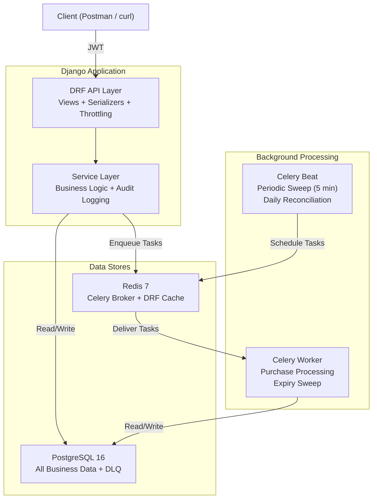
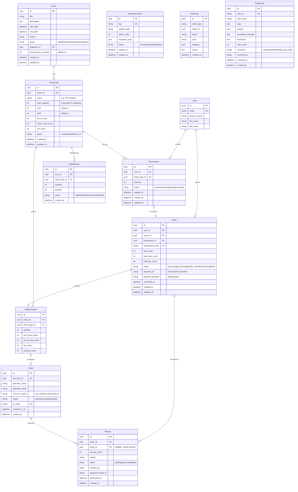

# Ticketing & Reservations Backend — Revised Implementation Plan

> [!IMPORTANT]
> This plan incorporates all simplifications from the [design rationale audit](file:///C:/Users/adham/.gemini/antigravity-ide/brain/ebf50d27-88cb-45c0-8985-04aa4abd3712/design_rationale.md). Overengineered items have been cut or simplified. Skills from `@mcp:agentic-awesome-skills` are annotated per section for the implementing LLM to load as context.

---

## Skill Manifest (Full Reference)

> [!NOTE]
> **For the implementing LLM:** Before starting each phase, load the skills listed in that phase's skill table using `@mcp:agentic-awesome-skills get_skill`. Only load skills relevant to the current phase — don't load all at once.

| Skill ID | Category | Use For |
|---|---|---|
| `django-pro` | Framework | Django 5.x, DRF, Celery, async views, project architecture |
| `postgres-best-practices` | Database | Schema design, indexing, query optimization, constraints |
| `django-perf-review` | Backend | N+1 detection, queryset optimization, ORM performance |
| `api-security-best-practices` | Security | Auth, input validation, rate limiting, API vulnerabilities |
| `api-design-principles` | Backend | REST conventions, endpoint design, error responses |
| `api-endpoint-builder` | Development | Endpoint scaffolding with validation, error handling, docs |
| `007` | Security | Threat modeling, OWASP checks, incident response |
| `container-security-hardening` | Security | Dockerfile review, non-root users, image scanning |
| `plan-writing` | Planning | Structured task breakdowns, dependencies, verification |
| `andrej-karpathy` | Guidelines | Avoid overcomplication, surgical changes, simplicity |
| `async-python-patterns` | Development | Concurrent programming, asyncio, non-blocking patterns |

---

## Architecture Overview



**Key Design Decisions (post-rationale):**

| Decision | Choice | Rationale Rating |
|---|---|---|
| Concurrency control | `SELECT FOR UPDATE` (2-statement, readable) | 🟢 ESSENTIAL |
| Inventory model | `held` + `sold` counters; reconciliation as safety net | 🟢 ESSENTIAL |
| Sync/Async boundary | Sync reservation, async purchase (Celery) | 🟢 ESSENTIAL |
| Reservation expiry | Periodic sweep only (every 60s via Celery Beat) | Simplified from hybrid |
| Primary keys | UUID everywhere (single field, non-guessable) | Simplified from dual-key |
| Idempotency | In purchase view/service directly (not middleware) | Simplified from middleware |
| Django apps | 3-4 apps (events, orders, core, payments) | Simplified from 6 apps |
| Celery queues | Single default queue | Simplified from 5 queues |
| ~~Fraud middleware~~ | **CUT** — rate limiting is sufficient | 🔴 Was overkill |

---

## Project Structure

```
PaymobTask/
├── docker-compose.yml
├── Dockerfile
├── requirements/
│   ├── base.txt
│   └── dev.txt
├── manage.py
├── config/                          # Project config
│   ├── __init__.py
│   ├── celery.py
│   ├── urls.py
│   ├── wsgi.py
│   └── settings/
│       ├── __init__.py
│       ├── base.py
│       └── dev.py
├── users/                           # Custom User model
│   ├── models.py
│   ├── serializers.py
│   ├── views.py
│   └── admin.py
├── events/                          # Event + TicketType
│   ├── models.py
│   ├── serializers.py
│   ├── views.py
│   ├── services.py
│   └── admin.py
├── orders/                          # Reservation + Order + Ticket + Refund
│   ├── models.py
│   ├── serializers.py
│   ├── views.py
│   ├── services/
│   │   ├── __init__.py
│   │   ├── reservation_service.py
│   │   ├── purchase_service.py
│   │   └── refund_service.py
│   ├── tasks.py
│   ├── exporters.py                 # CSV export logic
│   └── admin.py
├── payments/                        # Payment provider abstraction
│   ├── __init__.py
│   └── providers.py
├── core/                            # Cross-cutting concerns
│   ├── models.py                    # AuditLog, IdempotencyKey, FailedTask
│   ├── signals.py                   # Celery task_failure signal
│   └── management/
│       └── commands/
│           ├── seed_data.py
│           └── run_reconciliation.py
└── tests/
    ├── conftest.py
    ├── factories.py
    ├── test_reservations.py
    ├── test_purchases.py
    ├── test_concurrency.py          # 🏆 Crown jewel
    ├── test_refunds.py
    └── test_reconciliation.py
```

---

## Database Schema

### Entity-Relationship Diagram



### Critical Indexes

```sql
-- Reservation: expiry sweep needs to find active expired reservations fast
CREATE INDEX idx_reservation_expiry 
    ON orders_reservation (expires_at) 
    WHERE status = 'active';

-- Order: user's orders
CREATE INDEX idx_order_user 
    ON orders_order (user_id, created_at DESC);

-- Order: event reporting
CREATE INDEX idx_order_event_status 
    ON orders_order (event_id, status);

-- AuditLog: query by entity
CREATE INDEX idx_audit_entity 
    ON core_auditlog (entity_type, entity_id, created_at DESC);

-- FailedTask: ops dashboard
CREATE INDEX idx_failed_task_unresolved 
    ON core_failedtask (created_at DESC) 
    WHERE resolved_at IS NULL;
```

### Database Constraints (Defense in Depth)

```sql
ALTER TABLE events_tickettype ADD CONSTRAINT chk_sold_non_negative CHECK (sold >= 0);
ALTER TABLE events_tickettype ADD CONSTRAINT chk_held_non_negative CHECK (held >= 0);
ALTER TABLE events_tickettype ADD CONSTRAINT chk_no_oversell CHECK (sold + held <= total_capacity);
ALTER TABLE events_tickettype ADD CONSTRAINT chk_price_positive CHECK (price_cents >= 0);
ALTER TABLE orders_order ADD CONSTRAINT chk_total_positive CHECK (total_cents >= 0);
ALTER TABLE orders_refund ADD CONSTRAINT chk_refund_positive CHECK (amount_cents > 0);
```

> [!TIP]
> **💡 Tip for you:** These constraints are your last line of defense. Even if your Python code has a bug, the database refuses to enter an invalid state. If you ever see a `CHECK constraint violation` error, it means you found a concurrency bug before it reached production. Treat it as a gift, not a problem.

---

## Core Flows (Simplified Code)

### Reservation (Synchronous — 2-Statement Pattern)

```python
# orders/services/reservation_service.py

def create_reservation(user, ticket_type_id, quantity):
    with transaction.atomic():
        # Lock the row — other requests wait here (< 50ms)
        ticket_type = (
            TicketType.objects
            .select_for_update()
            .select_related('event')
            .get(id=ticket_type_id, status='active')
        )
        
        # Check capacity in Python (readable, debuggable)
        available = ticket_type.total_capacity - ticket_type.sold - ticket_type.held
        if available < quantity:
            raise InsufficientCapacityError(
                f"Requested {quantity}, only {available} available"
            )
        
        # Update held counter
        ticket_type.held += quantity
        ticket_type.save(update_fields=['held', 'updated_at'])
        
        # Create reservation
        hold_minutes = ticket_type.event.hold_duration_minutes
        reservation = Reservation.objects.create(
            user=user,
            ticket_type=ticket_type,
            quantity=quantity,
            status='active',
            expires_at=now() + timedelta(minutes=hold_minutes),
        )
        
        # Explicit audit log
        AuditLog.record(
            entity_type='ticket_type',
            entity_id=ticket_type.id,
            action='inventory_held',
            actor=user.email,
            reason=f'Reservation {reservation.id}',
            changes={'held': {'delta': quantity}},
        )
    
    return reservation
```

### Purchase (Asynchronous — Celery)

```python
# orders/views.py — the view just enqueues

class PurchaseView(APIView):
    throttle_scope = 'purchase'
    permission_classes = [IsAuthenticated]
    
    def post(self, request):
        serializer = PurchaseSerializer(data=request.data)
        serializer.is_valid(raise_exception=True)
        
        idem_key = request.headers.get('Idempotency-Key')
        if not idem_key:
            return Response({'error': 'Idempotency-Key header required'}, status=400)
        
        # Idempotency check — directly in the view (not middleware)
        existing_order = Order.objects.filter(idempotency_key=idem_key).first()
        if existing_order:
            return Response(OrderSerializer(existing_order).data)
        
        # Enqueue to Celery
        reservation_id = serializer.validated_data['reservation_id']
        process_purchase_task.delay(
            reservation_id=str(reservation_id),
            idempotency_key=idem_key,
            actor_email=request.user.email,
        )
        
        return Response({'status': 'processing', 'idempotency_key': idem_key}, status=202)


# orders/services/purchase_service.py — the actual logic

def process_purchase(reservation_id, idempotency_key, actor_email):
    with transaction.atomic():
        reservation = (
            Reservation.objects
            .select_for_update()
            .select_related('ticket_type', 'ticket_type__event', 'user')
            .get(id=reservation_id)
        )
        
        if reservation.status != 'active':
            raise ReservationNotActiveError()
        if reservation.expires_at < now():
            reservation.status = 'expired'
            reservation.save(update_fields=['status', 'updated_at'])
            raise ReservationExpiredError()
        
        ticket_type = reservation.ticket_type
        
        # Payment (Strategy Pattern)
        provider = get_payment_provider()
        result = provider.capture(
            amount_cents=ticket_type.price_cents * reservation.quantity,
            token="user_payment_token",
            idempotency_key=idempotency_key,
        )
        if not result.success:
            raise PaymentFailedError(result.error)
        
        # Move held → sold
        ticket_type.held -= reservation.quantity
        ticket_type.sold += reservation.quantity
        ticket_type.save(update_fields=['held', 'sold', 'updated_at'])
        
        # Create order + line items + tickets
        order = Order.objects.create(
            user=reservation.user,
            event=ticket_type.event,
            reservation=reservation,
            idempotency_key=idempotency_key,
            total_cents=ticket_type.price_cents * reservation.quantity,
            total_fees_cents=ticket_type.service_fee_cents * reservation.quantity,
            total_tax_cents=ticket_type.tax_cents * reservation.quantity,
            status='confirmed',
            payment_id=result.payment_id,
            payment_provider=provider.name,
            confirmed_at=now(),
        )
        
        line_item = OrderLineItem.objects.create(
            order=order,
            ticket_type=ticket_type,
            quantity=reservation.quantity,
            unit_price_cents=ticket_type.price_cents,
            service_fee_cents=ticket_type.service_fee_cents,
            tax_cents=ticket_type.tax_cents,
            subtotal_cents=ticket_type.price_cents * reservation.quantity,
        )
        
        Ticket.objects.bulk_create([
            Ticket(
                line_item=line_item,
                attendee_name=reservation.user.get_full_name(),
                attendee_email=reservation.user.email,
                qr_code=str(uuid4()),
            )
            for _ in range(reservation.quantity)
        ])
        
        reservation.status = 'confirmed'
        reservation.save(update_fields=['status', 'updated_at'])
        
        AuditLog.record(
            entity_type='ticket_type',
            entity_id=ticket_type.id,
            action='inventory_sold',
            actor=actor_email,
            reason=f'Order {order.id}',
            changes={'held': {'delta': -reservation.quantity}, 'sold': {'delta': reservation.quantity}},
        )
    
    return order
```

### Reservation Expiry (Simplified — Periodic Sweep Only)

```python
# orders/tasks.py

@shared_task
def sweep_expired_reservations():
    """
    Runs every 60 seconds via Celery Beat.
    Finds all active reservations past their expires_at and cleans them up.
    """
    stale_reservations = (
        Reservation.objects
        .filter(status='active', expires_at__lt=now())
        .select_related('ticket_type')
        .select_for_update(skip_locked=True)
    )
    
    expired_count = 0
    for reservation in stale_reservations:
        with transaction.atomic():
            reservation.ticket_type.held = F('held') - reservation.quantity
            reservation.ticket_type.save(update_fields=['held', 'updated_at'])
            reservation.status = 'expired'
            reservation.save(update_fields=['status', 'updated_at'])
            
            AuditLog.record(
                entity_type='reservation',
                entity_id=reservation.id,
                action='reservation_expired',
                actor='system',
                reason='Hold window exceeded',
                changes={'status': {'old': 'active', 'new': 'expired'}},
            )
            expired_count += 1
    
    if expired_count:
        logger.info(f"Expired {expired_count} stale reservations")
```

### Refund (Partial + Full)

```python
# orders/services/refund_service.py

def issue_refund(order_id, ticket_ids=None, reason='', actor=''):
    with transaction.atomic():
        order = Order.objects.select_for_update().get(id=order_id)
        
        if order.status in ('refunded', 'failed'):
            raise InvalidRefundError(f"Order is {order.status}")
        
        # Determine which tickets to refund
        if ticket_ids:
            tickets = Ticket.objects.filter(id__in=ticket_ids, line_item__order=order, status='active')
        else:
            tickets = Ticket.objects.filter(line_item__order=order, status='active')
        
        if not tickets.exists():
            raise InvalidRefundError("No active tickets to refund")
        
        # Process refund via payment provider
        refund_amount = sum(
            t.line_item.unit_price_cents + t.line_item.service_fee_cents
            for t in tickets.select_related('line_item')
        )
        provider = get_payment_provider()
        result = provider.refund(order.payment_id, refund_amount)
        if not result.success:
            raise PaymentRefundFailedError(result.error)
        
        # Create refund records + update ticket status
        for ticket in tickets:
            Refund.objects.create(
                order=order,
                ticket=ticket,
                amount_cents=ticket.line_item.unit_price_cents + ticket.line_item.service_fee_cents,
                reason=reason,
                status='processed',
                initiated_by=actor,
                payment_refund_id=result.payment_id,
                processed_at=now(),
            )
            ticket.status = 'refunded'
            ticket.save(update_fields=['status'])
        
        # Restore inventory (group by ticket type)
        from collections import Counter
        tt_counts = Counter(
            t.line_item.ticket_type_id
            for t in tickets.select_related('line_item')
        )
        for tt_id, qty in tt_counts.items():
            TicketType.objects.filter(id=tt_id).update(sold=F('sold') - qty)
        
        # Update order status
        remaining = Ticket.objects.filter(line_item__order=order, status='active').count()
        order.status = 'refunded' if remaining == 0 else 'partially_refunded'
        order.save(update_fields=['status', 'updated_at'])
        
        AuditLog.record(
            entity_type='order', entity_id=order.id, action='refund_issued',
            actor=actor, reason=reason,
            changes={'refund_amount_cents': refund_amount, 'tickets_refunded': tickets.count()},
        )
    
    return order
```

---

## Rate Limiting

```python
# config/settings/base.py

REST_FRAMEWORK = {
    'DEFAULT_THROTTLE_CLASSES': ['rest_framework.throttling.ScopedRateThrottle'],
    'DEFAULT_THROTTLE_RATES': {
        'reserve': '10/min',
        'purchase': '5/min',
        'refund': '3/min',
        'events_list': '60/min',
    },
}

CACHES = {
    'default': {
        'BACKEND': 'django_redis.cache.RedisCache',
        'LOCATION': 'redis://redis:6379/1',
    },
}
```

---

## DLQ (Dead Letter Queue)

```python
# core/signals.py — Celery signal, NOT Django model signal

from celery.signals import task_failure

@task_failure.connect
def handle_task_failure(sender, task_id, exception, traceback, args, kwargs, **kw):
    """After all retries exhausted, capture to DLQ table."""
    FailedTask.objects.create(
        task_id=task_id,
        task_name=sender.name,
        args=list(args) if args else [],
        kwargs=dict(kwargs) if kwargs else {},
        exception_message=str(exception),
        traceback=str(traceback),
        retry_count=getattr(sender.request, 'retries', 0),
    )
```

---

## Payment Provider (Strategy Pattern)

```python
# payments/providers.py

class PaymentResult:
    def __init__(self, success, payment_id=None, error=None):
        self.success = success
        self.payment_id = payment_id
        self.error = error

class PaymentProvider(ABC):
    name: str
    
    @abstractmethod
    def capture(self, amount_cents, token, idempotency_key) -> PaymentResult: ...
    
    @abstractmethod
    def refund(self, payment_id, amount_cents) -> PaymentResult: ...

class FakePaymentProvider(PaymentProvider):
    name = 'fake'
    
    def capture(self, amount_cents, token, idempotency_key):
        if random.random() < 0.9:
            return PaymentResult(success=True, payment_id=f"fake_{uuid4().hex[:12]}")
        return PaymentResult(success=False, error="Simulated decline")
    
    def refund(self, payment_id, amount_cents):
        return PaymentResult(success=True, payment_id=f"fake_ref_{uuid4().hex[:12]}")

class PaymobPaymentProvider(PaymentProvider):
    """
    Paymob Accept API integration.
    Docs: https://developers.paymob.com/paymob-docs/
    API keys loaded from environment variables (never in code).
    """
    name = 'paymob'
    
    def capture(self, amount_cents, token, idempotency_key):
        # TODO: Implement via Paymob Accept API
        raise NotImplementedError("Paymob integration pending")

def get_payment_provider() -> PaymentProvider:
    provider_class = import_string(settings.PAYMENT_PROVIDER_CLASS)
    return provider_class()
```

---

## Celery Configuration

```python
# config/celery.py
app = Celery('paymob_ticketing')
app.config_from_object('django.conf:settings', namespace='CELERY')
app.autodiscover_tasks()

# config/settings/base.py
CELERY_BROKER_URL = 'redis://redis:6379/0'
CELERY_RESULT_BACKEND = 'django-db'
CELERY_ACCEPT_CONTENT = ['json']
CELERY_TASK_SERIALIZER = 'json'
CELERY_TASK_ACKS_LATE = True           # Don't ack until task completes
CELERY_WORKER_PREFETCH_MULTIPLIER = 1  # Fetch one task at a time

CELERY_BEAT_SCHEDULE = {
    'sweep-expired-reservations': {
        'task': 'orders.tasks.sweep_expired_reservations',
        'schedule': 60.0,  # Every 60 seconds
    },
    'daily-reconciliation': {
        'task': 'core.tasks.run_reconciliation_task',
        'schedule': crontab(hour=2, minute=0),  # 2 AM daily
    },
}
```

---

## Reporting & CSV Schemas

**Daily Sales Report:**
```csv
date,event_id,event_title,orders_count,gross_revenue_cents,total_fees_cents,total_tax_cents,total_refunds_cents,net_revenue_cents
2026-08-04,evt_abc,"Summer Concert",150,1500000,75000,120000,50000,1545000
```

**Attendee Export:**
```csv
ticket_id,order_id,attendee_name,attendee_email,ticket_type,unit_price_cents,check_in_status,checked_in_at
tkt_def,ord_abc,"Adham Mohamed",adham@example.com,"VIP",15000,"not_checked_in",
```

**Audit Export:**
```csv
timestamp,entity_type,entity_id,action,actor,reason,changes
2026-08-04T14:22:33Z,ticket_type,uuid_here,inventory_held,user@example.com,"Reservation uuid_here","{""held"": {""delta"": 2}}"
```

**Reconciliation Report:**
```csv
ticket_type_id,name,total_capacity,sold,held,computed_available,actual_sold,actual_held,drift_sold,drift_held,status
uuid_here,"VIP",100,45,10,45,45,10,0,0,"OK"
```

---

## Operational Runbooks

### Incident: Stuck Worker or Backlog

| Field | Value |
|---|---|
| **Owner** | Ops / On-call |
| **Detection** | Queue length > 1000 for > 5 min |
| **TTR** | 15–30 minutes |

```bash
# 1. Check workers
celery -A config inspect ping
celery -A config inspect active

# 2. Check queue length
redis-cli LLEN celery

# 3. Restart workers
docker-compose restart celery_worker

# 4. If queue is huge, scale up temporarily
docker-compose up --scale celery_worker=3
```

### Incident: Oversell Detected

| Field | Value |
|---|---|
| **Owner** | Ops + Product |
| **Detection** | Reconciliation drift ≠ 0 |
| **TTR** | 1–4 hours |

```bash
# 1. Immediately pause sales
python manage.py shell -c "
TicketType.objects.filter(event_id='<ID>').update(status='paused')
"

# 2. Run reconciliation
python manage.py run_reconciliation --event-id <ID>

# 3. Identify offending orders (most recent near capacity)
python manage.py shell -c "
Order.objects.filter(event_id='<ID>', status='confirmed').order_by('-confirmed_at')[:10]
"

# 4. Root cause via audit logs
python manage.py shell -c "
AuditLog.objects.filter(entity_type='ticket_type', entity_id='<ID>').order_by('-created_at')[:20]
"

# 5. Fix counter + follow refund policy for oversold tickets
```

### Incident: Payment Captured but Order Not Created

| Field | Value |
|---|---|
| **Owner** | Ops + Finance |
| **Detection** | DLQ entry for `process_purchase_task` |
| **TTR** | 30–60 minutes |

```bash
# 1. Find in DLQ
python manage.py shell -c "
FailedTask.objects.filter(task_name='orders.tasks.process_purchase_task', resolved_at__isnull=True)
"

# 2. Verify payment status with provider (Paymob dashboard)
# 3. Retry the task OR issue manual refund
# 4. Mark DLQ entry as resolved
```

### Daily Maintenance

| Field | Value |
|---|---|
| **Owner** | Ops |
| **Schedule** | Daily |
| **Time** | 15 minutes |

```bash
python manage.py run_reconciliation        # Expect: 0 discrepancies
python manage.py shell -c "FailedTask.objects.filter(resolved_at__isnull=True).count()"  # Expect: 0
redis-cli LLEN celery                      # Expect: < 100
celery -A config inspect ping              # Expect: all pong
```

---

## Metrics & KPIs

| Category | Metric | Implementation | Alert |
|---|---|---|---|
| **Sales** | Orders/hour | `Order.objects.filter(created_at__gte=1h_ago).count()` | — |
| **Sales** | Revenue/event | `SUM(total_cents) GROUP BY event` | — |
| **Inventory** | Remaining/type | `total_capacity - sold - held` | < 10% remaining |
| **Reliability** | DLQ size | `FailedTask.objects.filter(resolved_at__isnull=True).count()` | > 0 |
| **Reliability** | Oversell incidents | Reconciliation drift | **CRITICAL: immediately** |
| **Operational** | Queue length | `redis-cli LLEN celery` | > 1000 |
| **CX** | Checkout success | `confirmed / (confirmed + failed)` | < 95% |
| **CX** | Refund turnaround | `AVG(processed_at - created_at)` | > 24h |

> [!TIP]
> **💡 Tip for you:** Implement metrics as DRF endpoints and management commands. In your README, mention that production would use Prometheus + Grafana. This shows you know the production path without building it.

---

## Docker Compose

```yaml
version: '3.8'

services:
  db:
    image: postgres:16-alpine
    environment:
      POSTGRES_DB: paymob_ticketing
      POSTGRES_USER: paymob
      POSTGRES_PASSWORD: devpassword
    ports: ["5432:5432"]
    volumes: [pgdata:/var/lib/postgresql/data]
    healthcheck:
      test: ["CMD-SHELL", "pg_isready -U paymob"]
      interval: 5s
      timeout: 5s
      retries: 5

  redis:
    image: redis:7-alpine
    ports: ["6379:6379"]
    healthcheck:
      test: ["CMD", "redis-cli", "ping"]
      interval: 5s
      timeout: 5s
      retries: 5

  web:
    build: .
    command: python manage.py runserver 0.0.0.0:8000
    volumes: [.:/app]
    ports: ["8000:8000"]
    env_file: .env
    depends_on:
      db: { condition: service_healthy }
      redis: { condition: service_healthy }

  celery_worker:
    build: .
    command: celery -A config worker -l info
    volumes: [.:/app]
    env_file: .env
    depends_on:
      db: { condition: service_healthy }
      redis: { condition: service_healthy }

  celery_beat:
    build: .
    command: celery -A config beat -l info
    volumes: [.:/app]
    env_file: .env
    depends_on:
      db: { condition: service_healthy }
      redis: { condition: service_healthy }

volumes:
  pgdata:
```

---

## Dependencies

```
# requirements/base.txt
Django>=5.1,<5.2
djangorestframework>=3.15
djangorestframework-simplejwt>=5.3
django-redis>=5.4
celery[redis]>=5.4
django-celery-beat>=2.6
django-celery-results>=2.5
psycopg[binary]>=3.2
python-decouple>=3.8
gunicorn>=22.0

# requirements/dev.txt
-r base.txt
factory-boy>=3.3
pytest>=8.0
pytest-django>=4.8
```

---

## 10-Day Implementation Phases with Skill Annotations

> [!IMPORTANT]
> **For the implementing LLM:** Before each phase, load ONLY the skills listed in that phase's table via `@mcp:agentic-awesome-skills get_skill`. This keeps context focused and avoids overloading.

---

### Phase 1: Foundation (Day 1)

**Deliverables:** Django project scaffolding, Docker Compose running, Custom User, JWT auth, settings split.

| Load Skill | Why |
|---|---|
| `django-pro` | Django 5.x project structure, Celery config, DRF setup |
| `container-security-hardening` | Dockerfile best practices (non-root user, multi-stage build) |
| `andrej-karpathy` | Avoid overcomplicating the scaffolding |

**Tasks:**
- [ ] `Dockerfile` + `docker-compose.yml` + `.env.example`
- [ ] Django project init (`config/` as project, split settings)
- [ ] Custom User model (`users/` app, `AbstractUser`, `AUTH_USER_MODEL`)
- [ ] JWT auth (simplejwt — register, login, token refresh endpoints)
- [ ] DRF config (throttling, JSON renderer, exception handler)
- [ ] Redis + Celery base config
- [ ] Verify: `docker-compose up` starts all 5 services, JWT login works

---

### Phase 2: Event Domain + Schema (Day 2)

**Deliverables:** Event and TicketType models, admin panel, CRUD API, DB constraints.

| Load Skill | Why |
|---|---|
| `postgres-best-practices` | Schema design, indexing strategy, CHECK constraints |
| `api-design-principles` | REST endpoint naming, response structure, status codes |
| `api-endpoint-builder` | DRF viewset scaffolding with validation |

**Tasks:**
- [ ] `events/models.py` — Event, TicketType with all fields and constraints
- [ ] Django admin for Event + TicketType (for manual data entry)
- [ ] Event CRUD API (list, retrieve, create for organizers)
- [ ] TicketType API (list per event, retrieve with availability)
- [ ] DB migration + apply constraints (CHECK, indexes)
- [ ] Add `computed_available` property on TicketType (`total_capacity - sold - held`)
- [ ] Verify: Create event + ticket types via admin, read via API

---

### Phase 3: Reservation Flow + Concurrency (Days 3–4)

**Deliverables:** Reservation creation with `SELECT FOR UPDATE`, expiry sweep, **concurrency test** 🏆

| Load Skill | Why |
|---|---|
| `django-pro` | `select_for_update()`, `transaction.atomic()`, Celery Beat |
| `postgres-best-practices` | Row-level locking, partial indexes |
| `django-perf-review` | Avoid N+1 in reservation queries |
| `007` | Rate limiting on reservation endpoint |

**Tasks:**
- [ ] `orders/models.py` — Reservation model
- [ ] `orders/services/reservation_service.py` — `create_reservation()` with `SELECT FOR UPDATE`
- [ ] `orders/views.py` — POST `/api/reservations/` (throttle_scope='reserve')
- [ ] Cancel reservation endpoint (user-initiated)
- [ ] `orders/tasks.py` — `sweep_expired_reservations()` (periodic, every 60s)
- [ ] Celery Beat schedule config
- [ ] `core/models.py` — AuditLog model + `AuditLog.record()` class method
- [ ] **🏆 Concurrency test**: 100 threads, 50 remaining tickets → exactly 50 successes, 50 failures
- [ ] Verify: reservation creates hold, expiry sweep cleans up, concurrency test passes

> [!WARNING]
> **💡 Critical tip:** Use `TransactionTestCase` (not `TestCase`) for the concurrency test. Django's default `TestCase` wraps everything in a single transaction, so threads can't see each other's writes. This is the #1 gotcha.

---

### Phase 4: Purchase Flow (Day 5)

**Deliverables:** Order + Ticket creation, Celery task, payment strategy pattern, DLQ.

| Load Skill | Why |
|---|---|
| `django-pro` | Celery task definition, `bind=True`, retries |
| `api-security-best-practices` | Idempotency key handling, input validation |
| `async-python-patterns` | Celery task patterns, retry with backoff |

**Tasks:**
- [ ] `orders/models.py` — Order, OrderLineItem, Ticket models
- [ ] `payments/providers.py` — PaymentProvider ABC, FakeProvider, PaymobProvider stub
- [ ] `orders/services/purchase_service.py` — `process_purchase()`
- [ ] `orders/tasks.py` — `process_purchase_task` (3 retries, exponential backoff)
- [ ] `orders/views.py` — POST `/api/purchases/` (idempotency check in view)
- [ ] GET `/api/orders/{id}/` — order detail with line items and tickets
- [ ] `core/models.py` — IdempotencyKey, FailedTask models
- [ ] `core/signals.py` — Celery `task_failure` signal → FailedTask
- [ ] Verify: reserve → purchase → order created, duplicate idempotency key returns same result

---

### Phase 5: Refunds + Audit (Days 6–7)

**Deliverables:** Full and partial refund flow, audit logging throughout, AuditLog export.

| Load Skill | Why |
|---|---|
| `django-pro` | `select_for_update()` in refund, `F()` expressions |
| `postgres-best-practices` | Atomic inventory restoration |
| `api-design-principles` | Refund endpoint design, error responses |

**Tasks:**
- [ ] `orders/models.py` — Refund model
- [ ] `orders/services/refund_service.py` — `issue_refund()` (partial + full)
- [ ] POST `/api/refunds/` endpoint (throttle_scope='refund')
- [ ] Verify inventory restoration: refund → `sold` decremented → tickets available again
- [ ] Add `AuditLog.record()` calls to ALL service functions (reservation, purchase, refund, expiry)
- [ ] WaitlistEntry model (schema only — no logic)
- [ ] Verify: full refund, partial refund, inventory restored, audit trail complete

---

### Phase 6: Reporting + Reconciliation (Day 8)

**Deliverables:** CSV exports, reconciliation service, metrics endpoint, seed data command.

| Load Skill | Why |
|---|---|
| `django-perf-review` | Efficient queryset aggregation for reports |
| `postgres-best-practices` | Aggregate queries, `annotate()`, `Sum()` |

**Tasks:**
- [ ] `orders/exporters.py` — CSV generators (sales, attendee, audit, reconciliation)
- [ ] Report API endpoints: GET `/api/reports/sales/`, `/api/reports/attendees/`, `/api/reports/audit/`
- [ ] `core/management/commands/run_reconciliation.py` — compare counters vs derived counts
- [ ] `core/management/commands/seed_data.py` — create test events, users, ticket types
- [ ] Metrics endpoint: GET `/api/metrics/` — all KPIs in JSON
- [ ] Verify: reconciliation shows 0 drift after a full reservation → purchase → refund cycle

---

### Phase 7: Testing + Load Test (Day 9)

**Deliverables:** Full test suite, load test script, all acceptance criteria verified.

| Load Skill | Why |
|---|---|
| `django-perf-review` | Identify N+1 queries in test runs |
| `007` | Security testing checklist (auth bypass, rate limit bypass) |
| `api-security-best-practices` | Validate rate limits, auth, input validation in tests |

**Tasks:**
- [ ] `tests/factories.py` — factory_boy factories for all models
- [ ] `tests/test_reservations.py` — unit + integration tests
- [ ] `tests/test_purchases.py` — idempotency, expired reservation, payment failure
- [ ] `tests/test_concurrency.py` — 🏆 THE concurrency test (should already exist from Day 4)
- [ ] `tests/test_refunds.py` — full, partial, double-refund prevention
- [ ] `tests/test_reconciliation.py` — verify 0 drift after complex scenarios
- [ ] Load test script (simple Python `concurrent.futures` script or locust)
- [ ] Verify: all tests pass, load test shows < 500ms reservation, < 2s purchase enqueue

---

### Phase 8: Polish + Documentation (Day 10)

**Deliverables:** README, runbook docs, Paymob provider stub, final review.

| Load Skill | Why |
|---|---|
| `andrej-karpathy` | Final review for overcomplication, unused code |
| `plan-writing` | Structured documentation |
| `api-design-principles` | API documentation quality |

**Tasks:**
- [ ] README.md — architecture diagram, setup instructions, API docs, design decisions
- [ ] Runbook documentation (can be in README or separate `docs/` folder)
- [ ] Paymob provider: implement if test API keys available, otherwise detailed stub
- [ ] Code cleanup: remove dead code, add docstrings to services
- [ ] Final `docker-compose up` from clean state → verify everything works
- [ ] Run full test suite one final time
- [ ] Verify: someone cloning the repo can `docker-compose up` and start testing within 5 minutes

---

## Open Questions (Resolved)

| Question | Resolution |
|---|---|
| Frontend needed? | No — API evaluated via Postman. No CORS needed. |
| Paymob sandbox? | User has test keys in `.env`. Implement PaymobProvider if time permits. |
| Seed data? | Management command `seed_data.py` — easy, done in Phase 6. |
| Notifications? | Email sufficient. Deferred — not in critical path. |
| Counter vs derived? | Counters with daily reconciliation as safety net. |
| Timeline? | 10 days with AI assistance. |

---

## Critical Path

> [!CAUTION]
> **If you fall behind, this is the priority order:**
> 1. **Days 1–4: Reservation + concurrency test passes** — Nothing else matters if oversell is possible
> 2. **Day 5: Purchase flow works end-to-end** — Reserve → Pay → Order created
> 3. **Days 6–7: Refunds restore inventory** — Core business requirement
> 4. **Days 8–10: Everything else is polish** — Reports, docs, load tests, Paymob

If Day 4's concurrency test fails, **stop everything and fix it.** The entire project's credibility rests on zero oversell.

